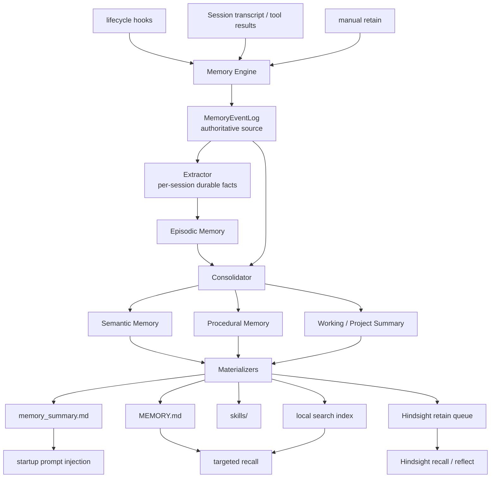
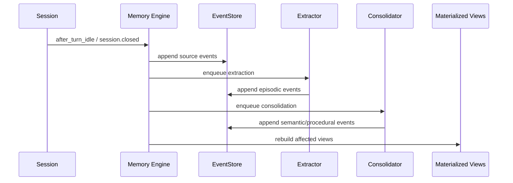
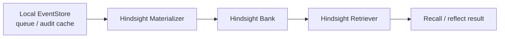

> **HISTORICAL - DO NOT USE AS REFERENCE.** This document is archived; it describes a design that has been implemented and may diverge from the current code. The current code is the authoritative source.

# Memory Engine Design

> **状态：已实施。** 本文档描述的架构已全部落地于 `internal/memory/engine/`
> 与 `internal/memory/`（Backend 接口、LocalBackend、HindsightBackend、
> Resolve 工厂）。下文"推荐迁移实施顺序"的 10 步全部完成。后续改进见
> `docs/memory-improvements-prd.md` 与 `docs/memory-lightweight-retrieval-plan.md`。

## 背景

Crush 现有记忆链路由多套机制叠加而成：

- `session_memory` 维护当前会话的工作状态。
- `extractMemories` 在对话结束后直接提取并写入长期记忆。
- `dream` 跨会话扫描 transcript，再次合并长期记忆。
- `auto recall` 按当前用户输入选择若干记忆注入上下文。
- `long_term_memory` 工具允许模型显式存取记忆。

这些机制各自有用，但职责边界重叠。长期记忆可以被多个入口写入，
召回又依赖当前 query 命中，导致两个核心问题：

1. **遗忘**: 如果 query 没命中、短 prompt 扩展失败、或关键信息位于长
   session 后半段，模型表现得像没有记忆。
2. **冗余和污染**: `extractMemories`、`dream`、手动 store 都能改长期
   memory，最终状态不可重建，也很难解释某条记忆来自哪里。

目标不是在这些机制上继续打补丁，而是建立一个单一的 Memory Engine。
所有长期记忆从同一条流水线产生，所有派生产物都可重建、可审计、可扩展。

## 设计目标

- 消除 `dream`、自动抽取、显式 store 之间的长期写入冗余。
- 不依赖 query recall 才想起基础项目和用户记忆。
- 保留当前会话恢复能力，但将其限定为短期 Working Memory。
- 明确区分 `local`、`hindsight`、`off` 三种互斥 backend，避免本地和远程
  召回混查。
- 每条长期记忆都带来源、时间、置信度、验证状态和过期信息。
- 让 `MEMORY.md`、`memory_summary.md`、skills 和本地检索索引成为可重建的
  派生产物，而不是事实源。

## 非目标

- 不保持旧 `dream` 语义。
- 不让模型直接修改最终 `MEMORY.md`。
- 不在一次召回中混合 local 和 Hindsight 结果。
- 不允许 local pipeline 和 remote backend 各自总结同一批 transcript 后再
  合并注入。
- 不为兼容旧命令牺牲架构边界。

## 核心原则

1. **单一写入入口**
   所有自动提取、手动 retain、compaction rescue 都先写入
   `MemoryEventLog`。在 `local` backend 中它是本地长期记忆的事实源；在
   `hindsight` backend 中它是可靠复制队列和审计缓存，远程 bank 是召回源。

2. **派生产物可重建**
   在 `local` backend 中，`memory_summary.md`、`MEMORY.md` 和 `skills/`
   都从 event log 重建。在 `hindsight` backend 中，本地 event log 只作为
   可靠写入队列和审计缓存，不参与召回。

3. **写入和召回分离**
   写入由 pipeline 控制。召回只读取记忆，不直接修改长期记忆。

4. **生命周期驱动**
   记忆系统由 session lifecycle 触发，而不是由若干独立 goroutine 随机
   扫描和写入。

5. **单一 backend 生效**
   如果选择 `local`，召回只读本地 materialized views 和 event log。如果
   选择 `hindsight`，召回和 reflect 只走 Hindsight；本地事件只用于可靠
   retain/replication，不和远程结果 merge。

## 整体架构



## 记忆层次

### Working Memory

Working Memory 只服务当前 session 的连续工作状态：

- 当前目标。
- 最近关键决策。
- 相关文件和命令。
- 未解决问题。
- 下一步动作。

它可以由当前 `session_memory` 改造而来，但必须保持短 TTL，不能直接视为
长期记忆。只有经过 extraction 后，才可以转化为 Episodic Memory。

### Episodic Memory

Episodic Memory 是每个 session 的稳定中间产物：

- 用户需求和约束。
- 实际排查路径。
- 确认有效的命令和工作流。
- 关键失败原因和修复结论。
- 需要未来复用的项目上下文。

它不是最终摘要，而是带 provenance 的事实块。它替代当前
`extractMemories` 直接写长期记忆的行为。

### Semantic Memory

Semantic Memory 是跨 session 合并后的稳定长期知识：

- 用户偏好。
- 项目架构和约定。
- 反复出现的排障路径。
- 已确认的技术决策。
- 高价值坑点和验证方式。

它由 Consolidator 从 Episodic Memory 和人工 retain 事件中生成。

### Procedural Memory

Procedural Memory 是足够稳定、可执行、可复用的流程。它可以 materialize
为 `skills/<name>/SKILL.md`，但只有当流程具备明确触发条件、输入、步骤和
验证方式时才生成。

## 数据模型

长期记忆不应直接以 Markdown 条目为权威结构。建议引入结构化事件：

```go
type MemoryScope string

const (
    MemoryScopeSession MemoryScope = "session"
    MemoryScopeProject MemoryScope = "project"
    MemoryScopeUser    MemoryScope = "user"
    MemoryScopeGlobal  MemoryScope = "global"
)

type MemoryKind string

const (
    MemoryKindPreference MemoryKind = "preference"
    MemoryKindDecision   MemoryKind = "decision"
    MemoryKindProcedure  MemoryKind = "procedure"
    MemoryKindPitfall    MemoryKind = "pitfall"
    MemoryKindReference  MemoryKind = "reference"
    MemoryKindTaskState  MemoryKind = "task_state"
)

type MemorySourceRef struct {
    SessionID  string
    MessageIDs []string
    Files      []string
    Commands   []string
    CWD        string
}

type MemoryEvent struct {
    ID          string
    Scope       MemoryScope
    Kind        MemoryKind
    Content     string
    Summary     string
    Source      MemorySourceRef
    Confidence  float64
    Importance  float64
    CreatedAt   time.Time
    VerifiedAt  *time.Time
    ExpiresAt   *time.Time
    Supersedes  []string
    Tags        []string
}
```

关键点：

- `Source` 是必需字段。没有来源的长期记忆不能进入 Semantic Memory。
- `VerifiedAt` 区分历史观察和当前已验证事实。
- `ExpiresAt` 用于短期状态、临时路径、发布版本等易漂移信息。
- `Supersedes` 用于显式替代旧记忆，避免重复和冲突。

## 组件边界

不要实现一个过胖的 backend 接口。Memory Engine 应拆成可组合组件：

```go
type EventStore interface {
    Append(ctx context.Context, events []MemoryEvent) error
    Query(ctx context.Context, filter MemoryFilter) ([]MemoryEvent, error)
}

type Extractor interface {
    ExtractSession(ctx context.Context, session SessionRef) ([]MemoryEvent, error)
}

type Consolidator interface {
    Consolidate(ctx context.Context, events []MemoryEvent) ([]MemoryEvent, error)
}

type Materializer interface {
    Build(ctx context.Context, events []MemoryEvent) error
}

type Retriever interface {
    Recall(ctx context.Context, query RecallQuery) ([]MemoryItem, error)
    Reflect(ctx context.Context, query RecallQuery) (string, error)
}

type Replicator interface {
    Sync(ctx context.Context, events []MemoryEvent) error
}
```

### EventStore

EventStore 是唯一权威写入点。第一版建议用 SQLite：

- `memory_events`
- `memory_sources`
- `memory_jobs`
- `memory_materialized_views`

这样可以做 watermark、lease、retry、status 和重建。

### Extractor

Extractor 读取 session transcript 和工具结果，生成 Episodic Memory 事件。
它只写 event log，不写 `MEMORY.md`。

### Consolidator

Consolidator 从 event log 中选取 project/user/global 范围内的事件，生成
更稳定的 Semantic 和 Procedural Memory 事件。

### Materializer

Materializer 负责把事件转成不同消费形态。具体启用哪些 materializer 由
backend 决定：

- `memory_summary.md`: prompt-time compact summary。
- `MEMORY.md`: 人类可读的完整长期记忆。
- `skills/`: 程序化流程。
- `hindsight_replicate`: 将 durable events 复制到 Hindsight。

`local` backend 启用前三类本地 materializer。`hindsight` backend 只启用
Hindsight replication materializer，不生成本地 summary 作为召回来源。

### Retriever

Retriever 只读取当前 backend 的召回来源。它不参与长期写入：

- `local`: 读取 `memory_summary.md`、当前 session working memory 和本地
  event log。
- `hindsight`: 调用 Hindsight `recall` / `reflect`，不 fallback 到本地
  summary。

## 生命周期

参考 Hindsight OpenCode 插件的 hook 思路，但将写入统一收敛到本地
Memory Engine。

### session.created

- 初始化 Memory Engine session state。
- 加载当前 user/project summary。
- 标记首轮需要注入记忆。

### before_prompt_build

- 注入 `user_summary` 和 `project_summary`。
- 如果存在当前 session Working Memory，也一起注入。
- 注入内容必须声明：记忆是历史上下文，当前用户指令和仓库状态优先。

### after_turn_idle

- 追加新的 transcript slice 到 event log source area。
- 节流触发 Working Memory 更新。
- 排队 Stage 1 extraction。

### before_compaction

- 强制 flush 当前 Working Memory。
- 追加 compaction rescue event。
- 压缩后重新注入 Working Memory 和 project summary。

### session.closed

- flush pending writes。
- 排队最终 Stage 1 extraction。
- 如达到阈值，排队 Stage 2 consolidation。

## 写入路径



手动 `retain` 也走同一条路径：

```text
retain tool -> MemoryEventLog -> consolidation -> materialized views
```

它不能直接写 `MEMORY.md`。

## 召回路径

默认上下文不依赖 query recall：

1. 每个新 session 注入 user summary。
2. 每个新 session 注入当前 project summary。
3. 当前 session 如有 Working Memory，注入 Working Memory。

Targeted recall 只作为补充：

- 用户询问历史决策。
- 当前任务与已知 pitfall、procedure、reference 匹配。
- compaction 后需要恢复更多细节。
- 模型显式调用 `recall`。

`reflect` 用于跨多条记忆综合回答，不应默认写入长期记忆。只有模型或用户
明确 retain 时，reflect 的结论才进入 event log。

## 远程记忆和 Hindsight

Hindsight 是一个独立 backend，而不是 local backend 的附加检索层。选择
`hindsight` 后：

- 本地 SQLite EventStore 仍然接收 extractor、manual `retain` 和
  compaction rescue 产生的 events。
- Hindsight materializer 按 watermark 将 durable events 复制到远程 bank。
- `recall` 和 `reflect` 只调用远程 Hindsight。
- 本地 `memory_summary.md`、`MEMORY.md`、`skills/` 不参与 prompt injection
  或 targeted recall。
- 远程不可用时状态应降级并暴露错误，不静默 fallback 到 local，避免用户误以为
  正在使用远程记忆。



这样保留 Hindsight 的优势：

- first-turn recall。
- idle retain。
- compaction rescue。
- `retain` / `recall` / `reflect` 工具模型。

同时避免 local summary 和 remote recall 对同一批 transcript 产生双重解释。

## 删除和替换现有机制

### 删除 `dream`

`dream` 的职责由 Stage 2 consolidation 取代。旧实现的问题：

- 直接扫描有限 session transcript。
- 输入窗口小。
- 缺少 per-session durable intermediate。
- 直接 apply memory，无法重建和审计。

### 删除自动长期直写 `extractMemories`

自动提取仍然需要，但只允许生成 Episodic Memory events。不能直接写最终
长期记忆。

### 降级 `auto recall`

Auto recall 不再是记忆主入口。基础记忆通过 summary injection 进入上下文。
Recall 只负责补充细节。

### 保留并改造 `session_memory`

保留 Working Memory 能力，但把它纳入 Memory Engine lifecycle。它不是
长期事实源。

### 改造 `long_term_memory`

旧 `long_term_memory` 工具应拆分或替换为：

- `retain`: 追加 MemoryEvent。
- `recall`: 读取 materialized memory 和索引。
- `reflect`: 基于召回结果综合回答。
- `memory_status`: 查看 pipeline、view、sync 状态。

## 配置建议

当前实现使用互斥 backend：

```json
{
  "options": {
    "memory": {
      "backend": "local"
    }
  }
}
```

```json
{
  "options": {
    "memory": {
      "backend": "hindsight",
      "remote": "http://localhost:8888",
      "remote_bank_id": "crush",
      "remote_scoping": "per-project-tagged"
    }
  }
}
```

```json
{
  "options": {
    "memory": {
      "backend": "off"
    }
  }
}
```

`memory.enabled=false` 仍然兼容，效果等同禁用 memory。为了兼容早期配置，
如果只配置了 `memory.remote` 且没有显式 `backend`，会按 `hindsight`
处理；不会自动启用 local + remote 混合召回。

不提供 local 和 Hindsight 混查模式。需要切换来源时，用户必须显式切换
`memory.backend`。

Hindsight 远程模式支持三种项目作用域，参考 oh-my-pi 的 scoping 语义：

- `global`: 使用一个共享 bank，不自动附加项目过滤。
- `per-project`: 在 `remote_bank_id` 后追加当前项目 slug，形成独立 bank。
- `per-project-tagged`: 默认值。使用共享 bank，但 retain 自动写入
  `project:<slug>` tag，recall/reflect 自动携带同一 tag 且使用
  `tags_match=any`，让当前项目记忆和未打 tag 的全局记忆一起可见。

如果希望完全隔离项目，使用 `remote_scoping=per-project`；如果希望保留
共享全局记忆，同时区分项目，使用默认的 `per-project-tagged`。

## 命令和可观测性

需要提供统一管理入口：

- `/memory status`: 当前 backend、extraction、consolidation、
  materialization、remote sync 的最近状态。
- `/memory view summary`: 查看当前 prompt 注入内容。
- `/memory view events`: 查看事件源。
- `/memory rebuild`: 从 event log 重建 materialized views。
- `/memory verify`: 针对记忆中的文件、命令、引用做当前仓库验证。
- `/memory clear`: 清理本地事件和派生产物。

可观测性是必要能力。没有 status，就无法区分是未提取、未合并、未注入、
召回失败，还是模型忽略了记忆。

## 推荐迁移实施顺序

> 全部 10 步已完成。

无需兼容旧语义时，直接按以下顺序实现：

1. ✅ 新增 SQLite EventStore 和 memory job 表。
2. ✅ 引入 Memory Engine lifecycle hooks。
3. ✅ 把 Working Memory 纳入 Engine。
4. ✅ 实现 Stage 1 Extractor，生成 Episodic Memory events。
5. ✅ 实现 Stage 2 Consolidator，生成 Semantic / Procedural events。
6. ✅ 实现 materializers: `memory_summary.md`、`MEMORY.md`、`skills/`。
7. ✅ 用 summary injection 替换当前 query-first auto recall 主路径。
8. ✅ 用 `retain` / `recall` / `reflect` 替换 `long_term_memory`。
9. ✅ 删除 `dream` 和直接长期写入式 `extractMemories`。
10. ✅ 增加互斥的 `hindsight` backend: remote materializer、remote-only retriever
    和配置降级状态。

## 最终形态

最终系统只有一套记忆写入流水线：

```text
session transcript / manual retain / compaction rescue
        -> MemoryEventLog
        -> Extractor
        -> Episodic Memory
        -> Consolidator
        -> Semantic + Procedural Memory
        -> local backend: materialized views -> prompt injection + recall + reflect
        -> hindsight backend: remote retain -> Hindsight recall + reflect
```

这套设计消除了现有 `dream`、`extractMemories`、`auto recall` 之间的职责
重叠。它让记忆从“多个模型在不同时间直接改长期文本”变成“事件源驱动、
可重建、可验证、可扩展”的系统。
