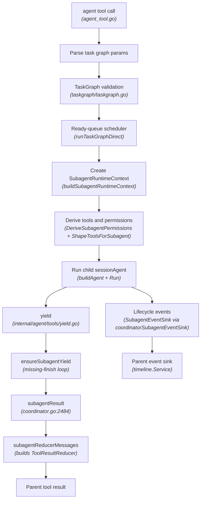

# Subagent Runtime Implementation Reference

> **HISTORICAL - DO NOT USE AS REFERENCE.** This document is retained for
> archive purposes only. It is outdated and does not match the current code
> (notably: it describes a TaskGraph DAG scheduler that no longer exists, and
> omits the lifecycle/keep-alive manager, worktree merge-back modes, and
> batch isolation auto-defaulting). The authoritative current-state reference
> is `docs/subagent-runtime.md`.

## Status

Historical implementation reference. Most sections describe the **currently
implemented** code state. Sections marked as "Planned" or with P0-P4 labels
are historical records of the original design plan; completed items are
checked.

## Scope

This specification defines how Crush should refactor subagent execution into a
first-class runtime while preserving the existing TaskGraph scheduler. It
covers:

- current implementation baseline,
- child session lifecycle,
- structured completion,
- status semantics,
- runtime context,
- permission derivation,
- tool profile shaping,
- event and approval forwarding,
- safe result summaries,
- retry and cancellation semantics,
- future isolation capability hooks.

It intentionally does not redesign Auto Mode. Existing Auto Mode approval policy
is treated as an external service that child agents may call through parent
authority when they need approval.

## Current Implementation Baseline

The following are **already implemented** and must not be re-implemented:

### subagentResult (coordinator.go:2484)

```go
type subagentResult struct {
    Task           subagentTask
    TaskRef        string
    Status         message.ToolResultSubtaskStatus
    AgentID        string
    ChildSessionID string
    Content        string
    Preview        string
    HasFullOutput  bool
    OutputChars    int
    Yield          message.ToolResultYield
    Warnings       []string
    Error          string
    Attempts       int
    Artifacts      []string
    FilesTouched   []string
    PatchPlan      []string
    TestResults    []string
    Followups      []string
}
```

### ToolResultSubtaskStatus (message/auto_mode.go)

```go
type ToolResultSubtaskStatus string

const (
    ToolResultSubtaskStatusPending    ToolResultSubtaskStatus = "pending"
    ToolResultSubtaskStatusInProgress ToolResultSubtaskStatus = "in_progress"
    ToolResultSubtaskStatusRunning    ToolResultSubtaskStatus = "running"
    ToolResultSubtaskStatusCompleted  ToolResultSubtaskStatus = "completed"
    ToolResultSubtaskStatusFailed     ToolResultSubtaskStatus = "failed"
    ToolResultSubtaskStatusCanceled   ToolResultSubtaskStatus = "canceled"
)
```

Both values are implemented.

### ToolResultReducer and siblings (message/auto_mode.go)

`ToolResultReducer`, `ToolResultReducerChildSession`, and
`ToolResultSubtaskResult` are fully defined with JSON tags and serialization
helpers (`ParseToolResultReducer`, `WithReducer`, `Reducer()`,
`WithSubtaskResult`, `SubtaskResult()`, etc.).

### EscalationBridge and WorkerIdentity (coordinator.go:3389-3401)

```go
// Present in runSubAgentDirect:
if c.escalationBridge != nil {
    workerIdentity := permission.WorkerIdentity{
        AgentID:         subSession.ID,
        AgentName:       params.SessionTitle,
        AgentType:       "subagent",
        ParentSessionID: runtime.ParentSessionID,
        ChildSessionID:  runtime.ChildSessionID,
        TaskID:          runtime.TaskID,
        ProfileName:     runtime.AgentProfile.Name,
    }
    ctx = permission.WithWorkerIdentity(ctx, workerIdentity)
    ctx = permission.WithEscalationBridge(ctx, c.escalationBridge)
}
```

### Explore Agent Tool Shape (tool_registration.go:80-89)

```go
} else if agent.ID == config.AgentExplore {
    bashOpts = agenttools.BashToolOptions{
        DisableBackground: true,
    }
}
```

The explore agent's `AllowedTools` config excludes `edit`, `write`, and
`download`. Background processes are disabled. This is enforced via config
and registration; P2 adds a `ShapeToolsForSubagent` runtime call on top.

### agent Tool Denied for Subagents (tool_registration.go:47)

```go
if config.NormalizeAgentMode(agent.Mode) != config.AgentModeSubagent &&
    slices.Contains(agent.AllowedTools, AgentToolName) {
    // register agent tool
}
```

Subagent-mode agents never receive the `agent` tool. Recursive delegation is
denied at registration time.

### yield Tool (internal/agent/tools/yield.go)

Full implementation of the `yield` tool:

```go
type YieldParams struct {
    Status  string          `json:"status"`
    Data    string          `json:"data,omitempty"`
    Error   string          `json:"error,omitempty"`
    Payload json.RawMessage `json:"payload,omitempty"`
}
```

The tool:
- validates terminal status (`completed`, `completed_with_warnings`, `failed`,
  `canceled`, `blocked`) — non-terminal values are rejected
- requires `error` for `failed` and `blocked`
- requires `data` or `payload` for success statuses
- validates payload against `OutputSchema` when configured (one retry on failure)
- stores metadata via `WithYield`/`ParseToolResultYield` in `auto_mode.go`
- rejects duplicate calls per session
- signals agent loop termination via `StopTurn`
- is exposed only in child sessions; hidden from primary sessions

### buildSubagentHandoffSummary (coordinator.go)

Builds a contextual handoff summary from the coordinator's session context
so the subagent has concrete context from prior work. Subagent sessions do
not receive the coordinator prompt injection (`buildDelegationPromptPrefix`).

### Removed from internal/autopermission/service.go

The following helpers were previously candidates for wiring into subagent
permission derivation but have been removed as dead code:

- `safeNullRedirectPattern` — removed, zero production references
- `isSafeReadOnlyBashSegment` — removed, zero production references
- `isSafeReadOnlyGitCommand` — removed, zero production references
- `classifyPluginDecision` — removed, zero production references
  (`classifyPluginDecisionWithRuntime` remains and is actively used)

Read-only safety for `explore` subagents is enforced via
`DerivedSubagentPermissions` and `BashToolOptions{DisableBackground: true}`.

## Architecture



**All nodes in this diagram are implemented.** TaskGraph handles graph-level
scheduling. `SubagentRuntimeContext` manages one child execution per session.

## Core Runtime Types

All types below are defined in `internal/agent/subagent_runtime.go`.

### SubagentRuntimeContext

```go
type SubagentRuntimeContext struct {
    ParentSessionID  string
    ChildSessionID   string
    ParentMessageID  string
    ParentToolCallID string
    TaskID           string
    TaskDescription  string

    AgentProfile SubagentProfile
    ToolProfile  SubagentToolProfile
    Permissions  DerivedSubagentPermissions
    Workspace    SubagentWorkspacePolicy
    Isolation    SubagentIsolation
    Result       SubagentResultContract
    Events       SubagentEventSink

    // MaxTurns is the maximum number of LLM turns the subagent is allowed.
    MaxTurns int
    // OutputSchema is the JSON schema for yield payload validation.
    OutputSchema any
    // FinishRequired indicates yield must be called for completion.
    FinishRequired bool
}
```

Built via `buildSubagentRuntimeContext(...)` before the child session starts.

Note: `ApprovalAuthority` and `SubagentRetryPolicy` were part of the original
design but are **not implemented**. `WorkerIdentity` on the escalation bridge
(line 3389 in coordinator.go) provides the equivalent permission authority
information directly.

### SubagentProfile

```go
type SubagentProfileKind string

const (
    SubagentProfileCoordinator SubagentProfileKind = "coordinator"
    SubagentProfileGeneral     SubagentProfileKind = "general"
    SubagentProfileExplore     SubagentProfileKind = "explore"
    SubagentProfilePlan        SubagentProfileKind = "plan"
    SubagentProfileReview      SubagentProfileKind = "review"
    SubagentProfileGuardian    SubagentProfileKind = "guardian"
)

type SubagentProfile struct {
    Name        string
    Kind        SubagentProfileKind
    Mode        string
    Description string
    CanSpawn    bool
    ReadOnly    bool
    ToolNames   []string
    DenyTools   []string
    Spawns      []string
}
```

Mapping from agent config to profile is done via `subagentProfileForAgent`.
Built-in defaults are provided for all agent types via config defaults.

### SubagentToolProfile

```go
type SubagentToolProfile struct {
    Allowed map[string]struct{}
    Denied  map[string]struct{}
}

func (p SubagentToolProfile) Allows(toolName string) bool {
    toolName = strings.TrimSpace(toolName)
    if toolName == "" {
        return false
    }
    if _, denied := p.Denied[toolName]; denied {
        return false
    }
    if len(p.Allowed) == 0 {
        return true
    }
    _, ok := p.Allowed[toolName]
    return ok
}
```

The tool profile is the authoritative filter when constructing the child tool
registry. A model must not be able to call a hidden tool merely because the
prompt says not to.

### SubagentWorkspacePolicy

```go
type SubagentWorkspacePolicy struct {
    Root      string
    WriteMode string
}
```

WriteMode is `"deny"` for read-only profiles, `"allow"` otherwise.

### SubagentIsolation

```go
type SubagentIsolationKind string

const (
    SubagentIsolationNone            SubagentIsolationKind = "none"
    SubagentIsolationWorktree        SubagentIsolationKind = "worktree"
    SubagentIsolationExternalSandbox SubagentIsolationKind = "external_sandbox"
    SubagentIsolationManagedSandbox  SubagentIsolationKind = "managed_sandbox"
)

type SubagentIsolation struct {
    Kind      SubagentIsolationKind
    Available bool
    Path      string
    Metadata  map[string]string
}
```

Only `none` and `worktree` are currently wired. `ExternalSandbox` and
`ManagedSandbox` are defined as constants but have no provider implementation.

### SubagentResultContract

```go
// MaxSummaryBytes and MaxStructuredDataBytes are reserved for future size limits.
type SubagentResultContract struct {
    Required             bool
    AllowRawTextFallback bool
    MissingFinishPolicy  MissingFinishPolicy
}

type MissingFinishPolicy string

const (
    MissingFinishWarn          MissingFinishPolicy = "warn"
    MissingFinishFail          MissingFinishPolicy = "fail"
    MissingFinishRetryThenWarn MissingFinishPolicy = "retry_then_warn"
    MissingFinishRetryThenFail MissingFinishPolicy = "retry_then_fail"
)
```

Default contract by profile (in `subagentResultContract`):

| Profile | Required | Missing Policy | Raw Fallback |
|---|---|---|---|
| `explore` | true | `retry_then_warn` | yes |
| `plan` | true | `retry_then_warn` | yes |
| `review` | true | `retry_then_warn` | yes |
| `guardian` | true | `fail` | no |
| `general` (default) | true | `retry_then_fail` | yes |

### DerivedSubagentPermissions (subagent_permissions.go)

```go
type DerivedSubagentPermissions struct {
    AllowedTools              map[string]struct{}
    DeniedTools               map[string]struct{}
    ReadOnly                  bool
    CanSpawn                  bool
    AgentToolExternallyDenied bool
}
```

Derived via `DeriveSubagentPermissions(parent, profile, availableTools)` using
a deny-wins intersection algorithm.

### SubagentEventSink and SubagentEvent

```go
type SubagentEventSink interface {
    PublishSubagentEvent(ctx context.Context, event SubagentEvent)
}

type SubagentEventType string

const (
    SubagentEventStarted  SubagentEventType = "started"
    SubagentEventProgress SubagentEventType = "progress"
    SubagentEventFinish   SubagentEventType = "finish"
    SubagentEventFailed   SubagentEventType = "failed"
    SubagentEventCanceled SubagentEventType = "canceled"
    SubagentEventBlocked  SubagentEventType = "blocked"
)

type SubagentEvent struct {
    Type            SubagentEventType
    ParentSessionID string
    ChildSessionID  string
    TaskID          string
    Message         string
    Status          string
    Timestamp       time.Time
}
```

Implemented by `coordinatorSubagentEventSink` wrapping `timeline.Service`.
Events are published during subagent start, progress, and termination.

## Structured Completion Tool

### Tool Name

The completion tool is named `yield` (Go constant `YieldToolName` in
`internal/agent/tools/yield.go`). Metadata is stored under the key `yield`
and uses the `ToolResultYield` type in `internal/message/auto_mode.go`.

### Exposure Rules

- Expose only in child sessions (`isSubAgent == true`). Hidden from primary
  and coordinator-primary sessions at tool registration time.
- Only one valid yield result is accepted per session. Subsequent calls return
  an error. The first valid terminal call is authoritative.
- When `OutputSchema` is configured on the subagent, the tool validates the
  `payload` field against the schema (one retry on failure to prevent loops).

### Parameters

```go
type YieldParams struct {
    Status  string          `json:"status"`
    Data    string          `json:"data,omitempty"`
    Error   string          `json:"error,omitempty"`
    Payload json.RawMessage `json:"payload,omitempty"`
}
```

Validation rules (in `NewYieldTool`):

- `status` defaults to `"completed"` if empty; non-terminal values
  (`pending`, `in_progress`, `running`) are rejected.
- `error` is required for `failed` and `blocked`.
- `data` or `payload` is required for success statuses (`completed`,
  `completed_with_warnings`).
- `payload` is validated against `OutputSchema` when configured.
- Duplicate calls are rejected.

### Metadata Type (internal/message/auto_mode.go)

```go
const toolResultYieldMetadataKey = "yield"

type ToolResultYield struct {
    Data    string          `json:"data,omitempty"`
    Status  string          `json:"status,omitempty"`
    Error   string          `json:"error,omitempty"`
    Payload json.RawMessage `json:"payload,omitempty"`
}

func ParseToolResultYield(metadata string) (ToolResultYield, bool)
func (t ToolResult) Yield() (ToolResultYield, bool)
func (t ToolResult) WithYield(yield ToolResultYield) ToolResult
```

`ToolResultSubagentFinish` and `WithSubagentFinish`/`ParseToolResultSubagentFinish`
also exist in `auto_mode.go` as an earlier design representation. The `yield` tool
is the active implementation.

### Missing Finish Loop (ensureSubagentYield, coordinator.go:3194)

After `sessionAgent.Run` returns for a foreground child, `ensureSubagentYield`:

1. Scans child session messages for `ToolResultYield` metadata.
2. If found, returns the structured yield result.
3. If `!runtime.Result.Required`, returns empty — raw text fallback allowed.
4. If `MissingFinishPolicy` includes retry: sends up to 2 reminder prompts:
   `"Call yield exactly once now. Summarize only the work already completed.
   Do not start new work unless needed to determine final status."`
5. After exhausting retries:
   - `fail` / `retry_then_fail` → marks `ToolResultSubtaskStatusFailed`
   - `warn` / `retry_then_warn` → marks `ToolResultSubtaskStatusCompletedWithWarnings`
     with fallback text.

## Lifecycle and Status Semantics

### Public Status Values (message/auto_mode.go)

```go
type ToolResultSubtaskStatus string

const (
    ToolResultSubtaskStatusPending               ToolResultSubtaskStatus = "pending"
    ToolResultSubtaskStatusInProgress            ToolResultSubtaskStatus = "in_progress"
    ToolResultSubtaskStatusRunning               ToolResultSubtaskStatus = "running"
    ToolResultSubtaskStatusCompleted             ToolResultSubtaskStatus = "completed"
    ToolResultSubtaskStatusCompletedWithWarnings ToolResultSubtaskStatus = "completed_with_warnings"
    ToolResultSubtaskStatusFailed                ToolResultSubtaskStatus = "failed"
    ToolResultSubtaskStatusCanceled              ToolResultSubtaskStatus = "canceled"
    ToolResultSubtaskStatusBlocked               ToolResultSubtaskStatus = "blocked"
)
```

All values are implemented. No internal `SubagentRuntimeStatus` type was
created; the code uses `message.ToolResultSubtaskStatus` directly.

### Dependency Release Rule

The dependency check at coordinator.go uses `!= completed` to gate releases.
The P0 plan to add `statusReleasesDependents` including `completed_with_warnings`
has **not been implemented** — the check remains `!= completed` only. This is a
remaining gap if `completed_with_warnings` should release dependents.

### Background Tasks

For task-level background execution:

- Build `SubagentRuntimeContext` with isolation `none`.
- Launch child session in background goroutine.
- Return `running` status immediately.
- Do not release dependents.
- Record child session ID in `subagentResult.ChildSessionID`.
- Expose polling through `subtask_result`.

For graph-level background execution (`params.RunInBackground == true`):

- Launch graph supervisor in background.
- Return background agent ID in tool response.
- Graph result is retrieved later via `subtask_result`.

## Permission Derivation

### ParentPermissionContext (subagent_permissions.go)

```go
type ParentPermissionContext struct {
    SessionID    string
    AgentName    string
    AllowedTools []string
    DeniedTools  []string
    ExternalDeny []string
    Mode         string
}
```

Populated from the parent session config and the parent agent's `AllowedTools`.

### DerivedSubagentPermissions (subagent_permissions.go)

```go
type DerivedSubagentPermissions struct {
    AllowedTools              map[string]struct{}
    DeniedTools               map[string]struct{}
    ReadOnly                  bool
    CanSpawn                  bool
    AgentToolExternallyDenied bool
}
```

### Algorithm (internal/agent/subagent_permissions.go:20)

The actual implementation follows this flow:

1. Intersect profile `ToolNames` with `availableTools`. If empty (no profile
   restriction), use all available tools.
2. If parent has an explicit `AllowedTools`, intersect with that.
3. Always include mandatory subagent tools (`yield`).
4. Dynamically preserve non-builtin tools (MCP, custom plugins) from parent.
5. Union deny sources: `parent.DeniedTools`, `parent.ExternalDeny`,
   `profile.DenyTools`, and global denied tools (`plan_exit`, `request_user_input`).
6. If `ReadOnly`: add `edit`, `write`, `download`, `retain`, `todos`,
   `send_message`, `task_stop`, LSP mutation tools to denied set.
7. If `!CanSpawn`: add `agent` to denied set.
8. Subtract denied from allowed.

**Note:** The `Rules []permission.Rule` field from the original design was not
implemented. Permission enforcement uses `WorkerIdentity` on the escalation
bridge instead.

Required behavior:

- Deny wins over allow in all cases.
- Parent denies propagate to all descendants regardless of profile.
- Read-only profiles deny `edit`, `write`, `download`, mutating bash, and
  unknown plugin tools.
- Child cannot gain tools the parent explicitly denied, even if the child
  profile lists them.
- Recursive `agent` is denied by default; only allowed if `profile.CanSpawn`
  is true and the parent also allows it.

## Tool Profile Shaping

`ShapeToolsForSubagent` in `internal/agent/subagent_tools.go` is the
authoritative filter called during tool registry construction.

```go
func ShapeToolsForSubagent(
    all []fantasy.AgentTool,
    profile SubagentToolProfile,
) []fantasy.AgentTool {
    // ... filters by profile.Allows(name) ...
}
```

`shapeDeferredHintsForSubagent` filters `RegistryEntry` hints the same way.

Do not rely on prompt text for read-only enforcement. Runtime filtering is
primary; prompt is secondary.

### Built-in Profile Defaults

Profile defaults are derived from config agent definitions via
`subagentProfileForAgent`. The built-in agents have pre-configured
`AllowedTools` in `config/builtin_agents.go`. The `globalSubagentDeniedTools`
in `subagent_permissions.go` deny `plan_exit` and `request_user_input` for all
subagents. Read-only tools are denied via `readOnlyDeniedToolNames()`.

Key defaults:

| Profile | ReadOnly | CanSpawn | Key Denied Tools |
|---|---|---|---|
| `explore` | yes | no | `edit`, `write`, `download`, `agent`, LSP mutations |
| `plan` | yes | no | same as explore |
| `review` | yes | no | same as explore |
| `general` | no | varies | `agent` by default |

## Approval and Event Forwarding

### Approval Flow

```text
child tool request
  -> child permission service
  -> WorkerIdentity on escalation bridge (coordinator.go:3389)
  -> parent permission/autopermission service
  -> manual/auto policy decision
  -> result returned to child tool execution
```

Requirements:

- Approval request metadata includes `task_id`, `child_session_id`, and child
  profile name via `WorkerIdentity`.
- Child session cannot persist permission grants under its own authority if
  parent authority is required.
- Denials are reported both to the child (via permission error) and to the
  parent event sink.
- The `WorkerIdentity` injected at `coordinator.go:3389` already provides
  `AgentID`, `AgentType`, `ParentSessionID`, `ChildSessionID`, `TaskID`, and
  `ProfileName` for escalation bridge routing.

**Note:** The `ApprovalAuthority` type from the original design was not
implemented. Its function is fulfilled by `permission.WorkerIdentity` on the
escalation bridge directly.

### SubagentEventSink

```go
type SubagentEventType string

const (
    SubagentEventStarted  SubagentEventType = "started"
    SubagentEventProgress SubagentEventType = "progress"
    SubagentEventFinish   SubagentEventType = "finish"
    SubagentEventFailed   SubagentEventType = "failed"
    SubagentEventCanceled SubagentEventType = "canceled"
    SubagentEventBlocked  SubagentEventType = "blocked"
)

type SubagentEvent struct {
    Type            SubagentEventType
    ParentSessionID string
    ChildSessionID  string
    TaskID          string
    Message         string
    Status          SubagentRuntimeStatus
    Timestamp       time.Time
}

type SubagentEventSink interface {
    PublishSubagentEvent(ctx context.Context, event SubagentEvent)
}
```

Implementation in P1 can wrap the existing `c.timeline` pubsub path with a
thin adapter. The `timeline.ChildSessionFinishedEvent` calls at
`coordinator.go:3023` serve as the current analogue.

## Result Extraction and Reduction

### subagentResult (already complete, coordinator.go:2484)

The `subagentResult` struct already has all fields including `AgentID`,
`Yield`, `Warnings`, `Error`, and `Attempts` — no extension needed.

### Extraction Order (ensureSubagentYield)

After `sessionAgent.Run` returns for a foreground child, `ensureSubagentYield`
extracts in this order:

1. **Structured yield metadata** (`yield` key in child session tool results):
   most reliable, directly sets all output fields.
2. If yield not found and `!runtime.Result.Required`: raw text fallback.
3. If yield not found and `MissingFinishPolicy` includes retry: reminder loop
   (up to 2 prompts calling `yield`).
4. After reminders exhausted: apply `MissingFinishPolicy` — `fail` → `failed`,
   `warn` → `completed_with_warnings`.

### Safe Reducer (subagentReducerMessages)

The parent-visible reducer `subagentReducerMessages` in `coordinator.go:3822`
builds `ToolResultReducer` messages from `[]subagentResult`. The helper
`reduceResultToChildSession` maps individual results to
`ToolResultReducerChildSession`.

The graph-level reducer aggregates:

- counts by status (completed, failed, canceled, blocked)
- child session list (`ChildSessions`)
- files touched union
- test results union
- warnings from all nodes
- summary of any blocked or skipped dependency reasons

Raw child output must not be automatically injected into the parent context.
Use `subtask_result` for explicit full-transcript retrieval.

## Retry Semantics

**Not implemented.** The original design included `SubagentRetryPolicy`,
`ShouldRetrySubagent`, and `SideEffectSummary` but these were never built
in code. Retry behavior currently defaults to whatever the LLM provider or
agent loop provides naturally. The `DefaultRetryPolicy` config field
(`internal/config/config.go:992`) exists but is not consumed at runtime
(TODO noted in config).

## Cancellation Semantics

- Parent context cancellation propagates to all active child execution contexts
  via `ctx.Done()`.
- `task_stop` targets one task or mailbox graph and emits cancellation events.
- Child cancellation produces terminal `ToolResultSubtaskStatusCanceled`
  via `SubagentEventSink` and timeline events.
- Dependents of canceled tasks are finalized with `ToolResultSubtaskStatusCanceled`.
- Cleanup warnings (implemented via `SubagentEventSink` events) do not change
  terminal status from `completed` to `failed`.

## TaskGraph Changes

### statusReleasesDependents

**Not implemented.** The check at `coordinator.go` remains
`dependencyResult.Status != message.ToolResultSubtaskStatusCompleted`.
The `statusReleasesDependents` helper was never created, and
`completed_with_warnings` does not yet release dependents. This is a
remaining gap if that behavior is desired.

### Dependency Failure Propagation

When a dependency is in a non-releasing terminal state:

- Mark dependent as `ToolResultSubtaskStatusCanceled` (if dependency canceled)
  or `ToolResultSubtaskStatusBlocked` (if dependency failed/blocked).
- Do not start the dependent.
- Include the dependency task ID and failure reason in the reducer output.

### Background Task Nodes

For task nodes with `run_in_background == true`:

- Mark runtime status as `running` immediately.
- Return child session ID in the node result.
- Do not release dependents.
- Reducer includes a clear background section with polling instructions.

## Prompt Contract

Subagent system prompts include instructions to:

- Use only the tools provided; do not attempt to call tools outside your list.
- Complete your task by calling `yield` exactly once as your final action.
- Report all files touched.
- Report test commands run and outcomes.
- If you cannot complete the task, call `yield` with `blocked` or `failed`.
- For partial work worth preserving, use `completed_with_warnings`.

Runtime enforcement is primary (via `ShapeToolsForSubagent`). Prompt
instructions are secondary defense only.

## Configuration

### SubagentRuntimeConfig (internal/config/config.go:989)

```go
type SubagentRuntimeConfig struct {
    StructuredCompletionRequired bool   `json:"structured_completion_required,omitempty"`
    MissingFinishPolicy          string `json:"missing_finish_policy,omitempty"`
    DefaultRetryPolicy           string `json:"default_retry_policy,omitempty"`
    MaxConcurrency               int    `json:"max_concurrency,omitempty"`
    AllowRecursiveAgents         bool   `json:"allow_recursive_agents,omitempty"`
    DefaultIsolation             string `json:"default_isolation,omitempty"`
    SafeSummary                  bool   `json:"safe_summary,omitempty"`
}
```

Configurable via `crush.json` under the `"subagents"` key. Defaults are set
in `EffectiveSubagentRuntime()`:
- `StructuredCompletionRequired`: true
- `MaxConcurrency`: 4
- `AllowRecursiveAgents`: false
- `DefaultIsolation`: "none"
- `SafeSummary`: true

Implementation notes:
- `MissingFinishPolicy` is consumed by `applySubagentRuntimeConfig` at runtime.
- `AllowRecursiveAgents` is consumed by `applySubagentRuntimeConfig` — when true
  and the agent is not read-only, `CanSpawn` is set to true if the agent has no
  explicit `Spawns` config (legacy fallback).
- `DefaultRetryPolicy` exists in config but is **not consumed** at runtime.
- `SafeSummary` exists in config but is **not consumed** (structured finish is
  already preferred when available).
- `MaxConcurrency` has a TODO to be wired into the task graph semaphore.

Agent tool lists are configured via the `"agents"` section with `"mode": "subagent"`
and `"allowed_tools"` lists. Profile kind is derived from the canonical agent ID.

## Historical Implementation Plan

The P0–P4 plan below is a **historical record** of the original design intent.
Completed items are checked ✅. Items not checked were either not implemented
or the design was superseded by a different approach.

### ✅ P0: Structured Completion and Status Fixes (Implemented)

**Status: Mostly complete.** The tool is named `yield` (not `subagent_finish`).

**Completed work items:**
- ✅ `ToolResultSubtaskStatusCompletedWithWarnings` and `ToolResultSubtaskStatusBlocked`
  added to `message/auto_mode.go`.
- ✅ `ToolResultSubagentFinish` type and helpers (`ParseToolResultSubagentFinish`,
  `WithSubagentFinish`) exist in `auto_mode.go`.
- ✅ `ToolResultYield` type and helpers (`ParseToolResultYield`, `WithYield`) exist.
- ✅ `yield` tool (`internal/agent/tools/yield.go`) validates terminal status,
  requires `error` for failed/blocked, requires `data`/`payload` for success.
- ✅ Duplicate yield calls rejected per session.
- ✅ Missing-finish reminder loop (`ensureSubagentYield`) with configurable policy.
- ✅ `AgentID`, `Warnings`, `Error`, `Attempts` fields in `subagentResult`.

**Not implemented from original P0 plan:**
- ❌ `statusReleasesDependents` function was never created. Dependency check
  remains `!= ToolResultSubtaskStatusCompleted`.

---

### ✅ P1: SubagentRuntimeContext (Implemented)

**Status: Complete.**

- ✅ `internal/agent/subagent_runtime.go` exists with all core types:
  `SubagentRuntimeContext`, `SubagentProfile`, `SubagentToolProfile`,
  `SubagentWorkspacePolicy`, `SubagentResultContract`, `MissingFinishPolicy`,
  `SubagentIsolation`, `SubagentIsolationKind`, `SubagentEventSink`,
  `SubagentEvent`, `SubagentEventType`.
- ✅ `buildSubagentRuntimeContext` builds the context before child session starts.
- ✅ `coordinatorSubagentEventSink` wraps `timeline.Service`.
- ✅ Events emitted for start, progress, finish, failed, canceled, blocked.
- ❌ `ApprovalAuthority` type was **not implemented** — its role is fulfilled by
  `WorkerIdentity` on the escalation bridge.

---

### ✅ P2: Permission Derivation and Tool Shaping (Implemented)

**Status: Complete.**

- ✅ `internal/agent/subagent_permissions.go` — `ParentPermissionContext`,
  `DerivedSubagentPermissions`, `DeriveSubagentPermissions` with deny-wins
  intersection algorithm.
- ✅ `internal/agent/subagent_tools.go` — `ShapeToolsForSubagent` and
  `shapeDeferredHintsForSubagent`.
- ✅ `ShapeToolsForSubagent` called in tool registry construction for subagents.
- ✅ `subagent_permissions_test.go` and agent_tool tests exist.
- ❌ `Rules []permission.Rule` field in `ParentPermissionContext` was not
  implemented (no `permission.Rule` import).

---

### ❌ P3: Safe Summaries, Retry Safety, and Event Forwarding (Partial)

**Status: Partially implemented.** Event forwarding and safe summaries work;
retry safety was not built.

**Completed:**
- ✅ `reduceResultToChildSession` exists (coordinator.go:2898).
- ✅ `subagentReducerMessages` builds `ToolResultReducer` from results.
- ✅ `SubagentEventSink` events published for all lifecycle transitions.

**Not implemented:**
- ❌ `SubagentRetryPolicy` and `ShouldRetrySubagent` — not in code.
- ❌ `SideEffectSummary` — not in code.
- ❌ Retry gating via side effects — not implemented.
- ❌ `ApprovalAuthority.SessionID` routing — `WorkerIdentity` on escalation
  bridge is used instead.

---

### ❌ P4: Isolation Capabilities (Not Implemented)

**Status: Not implemented.**

- `SubagentIsolationProvider` interface was never created.
- Only `SubagentIsolationNone` is functionally wired (isolation kind parsed
  from config, worktree isolation is available via `prepareSubagentWorkspace`).
- `external_sandbox` and `managed_sandbox` remain enum constants with no
  provider implementation.

---

## Test Matrix (Historical Reference)

### Completion

| Test | Status | Notes |
|---|---|---|
| Child calls `yield(completed)` | ✅ Implemented | Via `ensureSubagentYield` |
| Child calls `yield(failed)` | ✅ Implemented | |
| Child calls `yield(completed_with_warnings)` | ✅ Implemented | |
| Child calls `yield(blocked)` | ✅ Implemented | |
| Child returns without yield; reminder succeeds | ✅ Implemented | Missing-finish loop |
| Child returns without yield; reminder fails; policy=warn | ✅ Implemented | |
| Child returns without yield; reminder fails; policy=fail | ✅ Implemented | |
| Duplicate `yield` calls | ✅ Implemented | Error on second call |
| Cleanup warning after valid yield(completed) | ✅ Implemented | |

### Status and Dependency

| Test | Status |
|---|---|
| Background task produces `running` | ✅ |
| `running` dependency check | ✅ (only `completed` releases) |
| `completed` dependency | ✅ |
| `completed_with_warnings` dependency | ❌ Not wired in dependency checker |
| `failed` dependency | ✅ Dependent canceled with reason |
| `canceled` dependency | ✅ |
| `blocked` dependency | ✅ |

### Permission and Tools

| Test | Status |
|---|---|
| Explore profile receives no edit/write/download | ✅ |
| Review profile receives no mutating tools | ✅ |
| General without CanSpawn receives no agent | ✅ |
| Parent denied + child allows = denied | ✅ |
| Parent explicit allowlist restricts child | ✅ |
| Non-builtin tools preserved for subagent | ✅ |

### Approval and Event Forwarding

| Test | Status | Notes |
|---|---|---|
| Child permission request uses parent authority | ✅ | Via `WorkerIdentity` |
| Approval request includes task_id | ✅ | In `WorkerIdentity` |
| Lifecycle events published | ✅ | Via `SubagentEventSink` |

### Retry

Not implemented (entire retry section is not built).

### Safe Summary

| Test | Status |
|---|---|
| Structured yield present → summary from yield | ✅ |
| No structured yield → sanitized fallback | ✅ |
| `subtask_result` returns full transcript | ✅ |
| Parent reducer excludes raw bash output | ✅ |

## Migration Strategy (Historical Reference)

1. ✅ `ToolResultSubagentFinish` metadata and `yield` tool coexist with
   `ToolResultSubtaskResult` and `ToolResultReducer`.
2. ✅ System prompts reference `yield` as the completion path.
3. ✅ Raw text fallback available for custom agents via
   `SubagentResultContract.AllowRawTextFallback`.
4. ✅ Explore agent is read-only restricted via tool profile shaping.
5. ❌ General-agent strictness with retry/side-effect tracking not implemented.
6. ✅ Agent tool schema has remained stable.
7. ❌ Renaming `auto_mode.go` types was not done (and not required).

## Resolved Design Decisions

The following questions from the original design were resolved during
implementation:

1. **Public status values:** `completed_with_warnings` and `blocked` were added
   to `ToolResultSubtaskStatus`. No internal `SubagentRuntimeStatus` type was
   created — the code uses `ToolResultSubtaskStatus` directly.

2. **Completion tool name:** Named `yield` (not `subagent_finish`). The
   `ToolResultSubagentFinish` type exists as a parallel metadata representation.

3. **Explore read-only bash:** Allowed via `BashToolOptions{DisableBackground: true}`
   and `AllowedTools` filtering. `DerivedSubagentPermissions` enforces at the
   permission layer.

4. **Worktree isolation:** Available but not enabled by default. Opt-in via
   `default_isolation: "worktree"` config. Not yet backed by an isolation provider
   interface.

5. **Output schema validation:** Implemented via `yield` tool's `OutputSchema`
   option. Supports JSON Schema compiled via `jsonschema` library. Payload
   validation applied with one retry on failure to prevent infinite loops.
