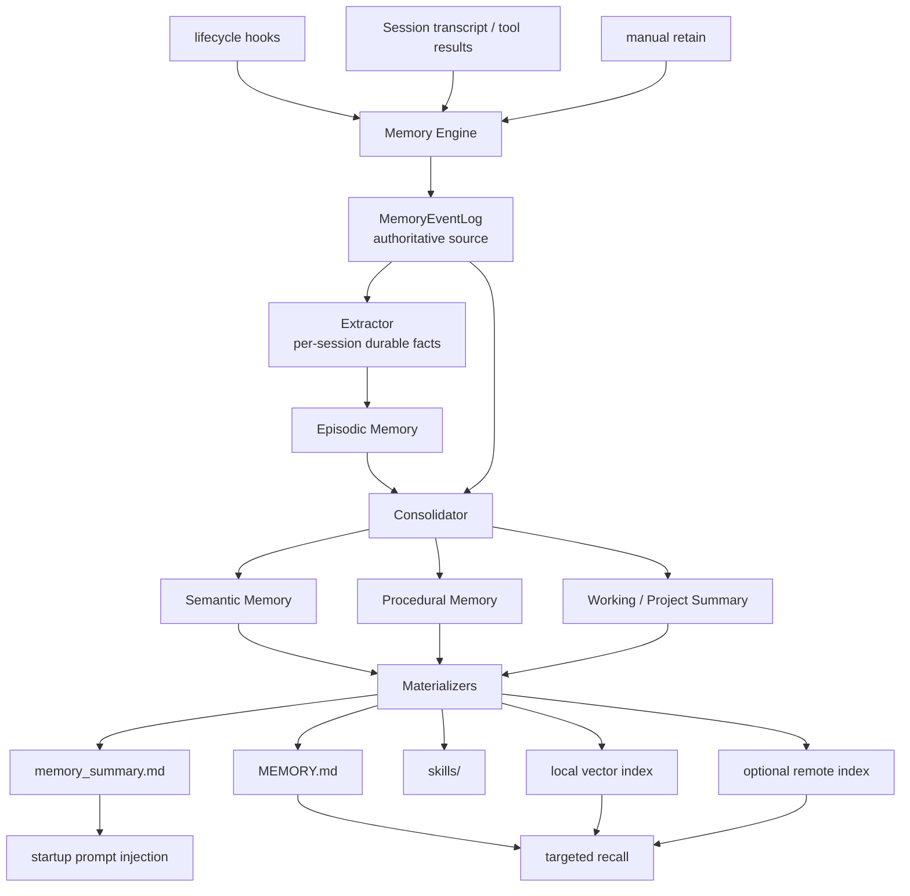
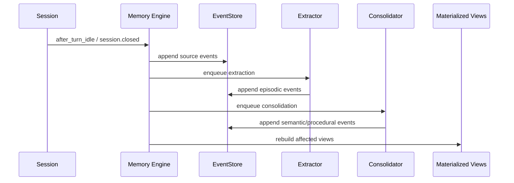
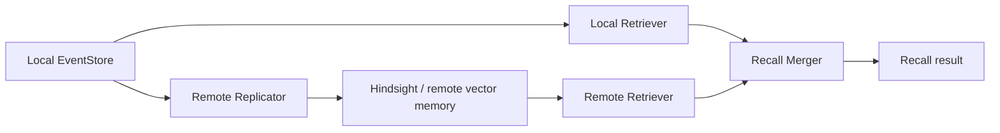

# Memory Engine Design

## 背景

Crush 现有记忆链路由多套机制叠加而成：

- `session_memory` 维护当前会话的工作状态。
- `extractMemories` 在对话结束后直接提取并写入长期记忆。
- `dream` 跨会话扫描 transcript，再次合并长期记忆。
- `auto recall` 按当前用户输入选择若干记忆注入上下文。
- `long_term_memory` 工具允许模型显式存取记忆。

这些机制各自有用，但职责边界重叠。长期记忆可以被多个入口写入，
召回又依赖当前 query 命中，导致两个核心问题：

1. **遗忘**: 如果 query 没命中、短 prompt 扩展失败、或关键信息位于长
   session 后半段，模型表现得像没有记忆。
2. **冗余和污染**: `extractMemories`、`dream`、手动 store 都能改长期
   memory，最终状态不可重建，也很难解释某条记忆来自哪里。

目标不是在这些机制上继续打补丁，而是建立一个单一的 Memory Engine。
所有长期记忆从同一条流水线产生，所有派生产物都可重建、可审计、可扩展。

## 设计目标

- 消除 `dream`、自动抽取、显式 store 之间的长期写入冗余。
- 不依赖 query recall 才想起基础项目和用户记忆。
- 保留当前会话恢复能力，但将其限定为短期 Working Memory。
- 让本地记忆成为权威事实源，远程服务只作为可选索引、同步或检索适配器。
- 每条长期记忆都带来源、时间、置信度、验证状态和过期信息。
- 让 `MEMORY.md`、`memory_summary.md`、skills 和向量索引成为可重建的
  materialized views，而不是事实源。

## 非目标

- 不保持旧 `dream` 语义。
- 不让模型直接修改最终 `MEMORY.md`。
- 不把远程 Hindsight 类服务作为唯一事实源。
- 不允许 local pipeline 和 remote backend 各自总结同一批 transcript。
- 不为兼容旧命令牺牲架构边界。

## 核心原则

1. **单一事实源**
   长期记忆的权威来源是 `MemoryEventLog`。所有自动提取、手动 retain、
   compaction rescue 都写入 event log。

2. **派生产物可重建**
   `memory_summary.md`、`MEMORY.md`、`skills/`、本地向量索引和远程索引
   都从 event log 重建。

3. **写入和召回分离**
   写入由 pipeline 控制。召回只读取记忆，不直接修改长期记忆。

4. **生命周期驱动**
   记忆系统由 session lifecycle 触发，而不是由若干独立 goroutine 随机
   扫描和写入。

5. **本地优先，远程可插拔**
   本地 event log 是权威源。远程 API 可以作为 `Retriever`、`Replicator`
   或 `VectorIndex`，但不能绕过本地事件流水线。

## 整体架构



## 记忆层次

### Working Memory

Working Memory 只服务当前 session 的连续工作状态：

- 当前目标。
- 最近关键决策。
- 相关文件和命令。
- 未解决问题。
- 下一步动作。

它可以由当前 `session_memory` 改造而来，但必须保持短 TTL，不能直接视为
长期记忆。只有经过 extraction 后，才可以转化为 Episodic Memory。

### Episodic Memory

Episodic Memory 是每个 session 的稳定中间产物：

- 用户需求和约束。
- 实际排查路径。
- 确认有效的命令和工作流。
- 关键失败原因和修复结论。
- 需要未来复用的项目上下文。

它不是最终摘要，而是带 provenance 的事实块。它替代当前
`extractMemories` 直接写长期记忆的行为。

### Semantic Memory

Semantic Memory 是跨 session 合并后的稳定长期知识：

- 用户偏好。
- 项目架构和约定。
- 反复出现的排障路径。
- 已确认的技术决策。
- 高价值坑点和验证方式。

它由 Consolidator 从 Episodic Memory 和人工 retain 事件中生成。

### Procedural Memory

Procedural Memory 是足够稳定、可执行、可复用的流程。它可以 materialize
为 `skills/<name>/SKILL.md`，但只有当流程具备明确触发条件、输入、步骤和
验证方式时才生成。

## 数据模型

长期记忆不应直接以 Markdown 条目为权威结构。建议引入结构化事件：

```go
type MemoryScope string

const (
    MemoryScopeSession MemoryScope = "session"
    MemoryScopeProject MemoryScope = "project"
    MemoryScopeUser    MemoryScope = "user"
    MemoryScopeGlobal  MemoryScope = "global"
)

type MemoryKind string

const (
    MemoryKindPreference MemoryKind = "preference"
    MemoryKindDecision   MemoryKind = "decision"
    MemoryKindProcedure  MemoryKind = "procedure"
    MemoryKindPitfall    MemoryKind = "pitfall"
    MemoryKindReference  MemoryKind = "reference"
    MemoryKindTaskState  MemoryKind = "task_state"
)

type MemorySourceRef struct {
    SessionID  string
    MessageIDs []string
    Files      []string
    Commands   []string
    CWD        string
}

type MemoryEvent struct {
    ID          string
    Scope       MemoryScope
    Kind        MemoryKind
    Content     string
    Summary     string
    Source      MemorySourceRef
    Confidence  float64
    Importance  float64
    CreatedAt   time.Time
    VerifiedAt  *time.Time
    ExpiresAt   *time.Time
    Supersedes  []string
    Tags        []string
}
```

关键点：

- `Source` 是必需字段。没有来源的长期记忆不能进入 Semantic Memory。
- `VerifiedAt` 区分历史观察和当前已验证事实。
- `ExpiresAt` 用于短期状态、临时路径、发布版本等易漂移信息。
- `Supersedes` 用于显式替代旧记忆，避免重复和冲突。

## 组件边界

不要实现一个过胖的 backend 接口。Memory Engine 应拆成可组合组件：

```go
type EventStore interface {
    Append(ctx context.Context, events []MemoryEvent) error
    Query(ctx context.Context, filter MemoryFilter) ([]MemoryEvent, error)
}

type Extractor interface {
    ExtractSession(ctx context.Context, session SessionRef) ([]MemoryEvent, error)
}

type Consolidator interface {
    Consolidate(ctx context.Context, events []MemoryEvent) ([]MemoryEvent, error)
}

type Materializer interface {
    Build(ctx context.Context, events []MemoryEvent) error
}

type Retriever interface {
    Recall(ctx context.Context, query RecallQuery) ([]MemoryItem, error)
    Reflect(ctx context.Context, query RecallQuery) (string, error)
}

type Replicator interface {
    Sync(ctx context.Context, events []MemoryEvent) error
}
```

### EventStore

EventStore 是唯一权威写入点。第一版建议用 SQLite：

- `memory_events`
- `memory_sources`
- `memory_jobs`
- `memory_materialized_views`

这样可以做 watermark、lease、retry、status 和重建。

### Extractor

Extractor 读取 session transcript 和工具结果，生成 Episodic Memory 事件。
它只写 event log，不写 `MEMORY.md`。

### Consolidator

Consolidator 从 event log 中选取 project/user/global 范围内的事件，生成
更稳定的 Semantic 和 Procedural Memory 事件。

### Materializer

Materializer 负责把事件转成不同消费形态：

- `memory_summary.md`: prompt-time compact summary。
- `MEMORY.md`: 人类可读的完整长期记忆。
- `skills/`: 程序化流程。
- local vector index: 精准召回。
- remote index: 可选同步。

### Retriever

Retriever 只读取 materialized views 和索引。它不参与长期写入。

## 生命周期

参考 Hindsight OpenCode 插件的 hook 思路，但将写入统一收敛到本地
Memory Engine。

### session.created

- 初始化 Memory Engine session state。
- 加载当前 user/project summary。
- 标记首轮需要注入记忆。

### before_prompt_build

- 注入 `user_summary` 和 `project_summary`。
- 如果存在当前 session Working Memory，也一起注入。
- 注入内容必须声明：记忆是历史上下文，当前用户指令和仓库状态优先。

### after_turn_idle

- 追加新的 transcript slice 到 event log source area。
- 节流触发 Working Memory 更新。
- 排队 Stage 1 extraction。

### before_compaction

- 强制 flush 当前 Working Memory。
- 追加 compaction rescue event。
- 压缩后重新注入 Working Memory 和 project summary。

### session.closed

- flush pending writes。
- 排队最终 Stage 1 extraction。
- 如达到阈值，排队 Stage 2 consolidation。

## 写入路径



手动 `retain` 也走同一条路径：

```text
retain tool -> MemoryEventLog -> consolidation -> materialized views
```

它不能直接写 `MEMORY.md`。

## 召回路径

默认上下文不依赖 query recall：

1. 每个新 session 注入 user summary。
2. 每个新 session 注入当前 project summary。
3. 当前 session 如有 Working Memory，注入 Working Memory。

Targeted recall 只作为补充：

- 用户询问历史决策。
- 当前任务与已知 pitfall、procedure、reference 匹配。
- compaction 后需要恢复更多细节。
- 模型显式调用 `recall`。

`reflect` 用于跨多条记忆综合回答，不应默认写入长期记忆。只有模型或用户
明确 retain 时，reflect 的结论才进入 event log。

## 远程记忆和 Hindsight

远程 API 不应作为另一套独立 backend。推荐抽象：

- 本地 EventStore 是权威源。
- 远程服务实现 `Retriever`、`Replicator` 或 `VectorIndex`。
- 本地 events 同步到远程。
- 召回时 local 和 remote merge。
- 冲突时本地 verified、新近、project-scoped 事件优先。



这样可以吸收 Hindsight 的优势：

- first-turn recall。
- idle retain。
- compaction rescue。
- `retain` / `recall` / `reflect` 工具模型。

但不会让远程服务绕过本地 provenance 和重建能力。

## 删除和替换现有机制

### 删除 `dream`

`dream` 的职责由 Stage 2 consolidation 取代。旧实现的问题：

- 直接扫描有限 session transcript。
- 输入窗口小。
- 缺少 per-session durable intermediate。
- 直接 apply memory，无法重建和审计。

### 删除自动长期直写 `extractMemories`

自动提取仍然需要，但只允许生成 Episodic Memory events。不能直接写最终
长期记忆。

### 降级 `auto recall`

Auto recall 不再是记忆主入口。基础记忆通过 summary injection 进入上下文。
Recall 只负责补充细节。

### 保留并改造 `session_memory`

保留 Working Memory 能力，但把它纳入 Memory Engine lifecycle。它不是
长期事实源。

### 改造 `long_term_memory`

旧 `long_term_memory` 工具应拆分或替换为：

- `retain`: 追加 MemoryEvent。
- `recall`: 读取 materialized memory 和索引。
- `reflect`: 基于召回结果综合回答。
- `memory_status`: 查看 pipeline、view、sync 状态。

## 配置建议

第一版配置保持简单：

```json
{
  "memory": {
    "enabled": true,
    "remote": {
      "enabled": false,
      "provider": "hindsight",
      "api_url": "http://localhost:8888"
    }
  }
}
```

不提供 `dream`、`local`、`hindsight` 三套并列逻辑。只有一个 Memory Engine。
远程只是 Engine 的可选适配器。

## 命令和可观测性

需要提供统一管理入口：

- `/memory status`: extraction、consolidation、materialization、remote sync
  的最近状态。
- `/memory view summary`: 查看当前 prompt 注入内容。
- `/memory view events`: 查看事件源。
- `/memory rebuild`: 从 event log 重建 materialized views。
- `/memory verify`: 针对记忆中的文件、命令、引用做当前仓库验证。
- `/memory clear`: 清理本地事件和派生产物。

可观测性是必要能力。没有 status，就无法区分是未提取、未合并、未注入、
召回失败，还是模型忽略了记忆。

## 推荐迁移实施顺序

无需兼容旧语义时，直接按以下顺序实现：

1. 新增 SQLite EventStore 和 memory job 表。
2. 引入 Memory Engine lifecycle hooks。
3. 把 Working Memory 纳入 Engine。
4. 实现 Stage 1 Extractor，生成 Episodic Memory events。
5. 实现 Stage 2 Consolidator，生成 Semantic / Procedural events。
6. 实现 materializers: `memory_summary.md`、`MEMORY.md`、`skills/`。
7. 用 summary injection 替换当前 query-first auto recall 主路径。
8. 用 `retain` / `recall` / `reflect` 替换 `long_term_memory`。
9. 删除 `dream` 和直接长期写入式 `extractMemories`。
10. 增加可选 Hindsight remote replicator/retriever。

## 最终形态

最终系统只有一套记忆写入流水线：

```text
session transcript / manual retain / compaction rescue
        -> MemoryEventLog
        -> Extractor
        -> Episodic Memory
        -> Consolidator
        -> Semantic + Procedural Memory
        -> materialized views
        -> prompt injection + recall + reflect
```

这套设计消除了现有 `dream`、`extractMemories`、`auto recall` 之间的职责
重叠。它让记忆从“多个模型在不同时间直接改长期文本”变成“事件源驱动、
可重建、可验证、可扩展”的系统。
