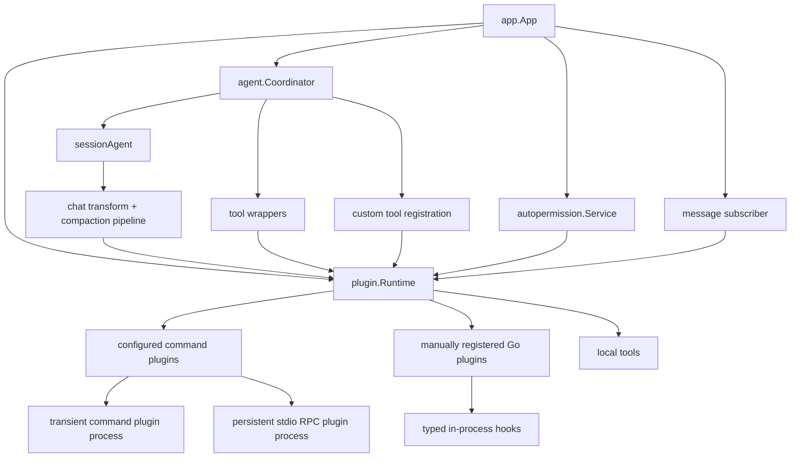

# Plugin Runtime Architecture

This document describes the current plugin/runtime architecture in Crush after
the runtime extraction, hook routing cleanup, and compaction integration work.

## Goals

- Make plugin state instance-scoped instead of implicitly global.
- Keep the existing `plugin.*` package API working as a compatibility layer
  during migration.
- Route plugin-triggered behavior through the same runtime from app startup
  down to agent execution, tool wrapping, permission overrides, and message
  lifecycle hooks.
- Align compaction and prompt transformation behavior with the OpenCode-style
  usable-budget flow without forcing the Go codebase into a highly abstract,
  hard-to-maintain trigger framework.

## Current Architecture

## Implemented Layers

- `plugin.Runtime` owns plugin registration, initialization, typed hook
  dispatch, custom tool state, and shutdown.
- `plugin.DefaultRuntime()` and package-level helpers such as `plugin.Init()`
  remain as compatibility wrappers so existing tests and call sites still work
  while the internals migrate toward explicit dependencies.
- `app.App` creates and owns the runtime, installs it as the active default
  runtime, wires it into `autopermission`, message-created subscription, and
  coordinator construction, then closes it during shutdown.
- `agent.Coordinator` passes the runtime into tool wrappers and every
  `sessionAgent` it creates.
- `sessionAgent` now resolves chat-before-request, message/system transforms,
  after-response hooks, and session-compacting hooks through its bound runtime
  rather than implicitly calling package-global trigger functions.
- Command plugins now build their transform hooks from hook descriptors, which
  centralizes request/response marshalling and makes the supported hook list
  derive from the same descriptor set.

## Why This Stops Here

The current shape is intentionally less abstract than OpenCode's Effect-based
plugin service.

High-value improvements that are now complete:

1. Runtime ownership is explicit in the app and agent path.
2. Compaction and prompt transforms share the same request-purpose-aware
   runtime hooks.
3. Command plugin hook wiring is descriptor-driven instead of three partially
   duplicated implementations.
4. The compatibility layer is narrow enough that future migrations can happen
   incrementally.

Further changes are possible, but the payoff drops quickly:

1. Converting every trigger into a generic descriptor registry would remove
   some repetition, but it would also obscure the typed Go hook surface.
2. Rebuilding the whole pipeline around a fully generic event bus would make
   Crush look more like OpenCode internally, but would add complexity without
   a clear product win today.
3. Splitting compaction into a separate service may still be worth doing later
   if the summarization pipeline grows, but it is no longer required to fix the
   current correctness and extensibility problems.
