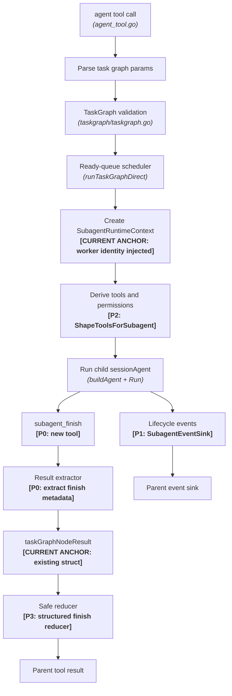

# Subagent Runtime Redesign Spec

## Status

Draft technical specification. Updated to accurately reflect codebase state
as of the most recent implementation pass.

## Scope

This specification defines how Crush should refactor subagent execution into a
first-class runtime while preserving the existing TaskGraph scheduler. It
covers:

- current implementation baseline,
- child session lifecycle,
- structured completion,
- status semantics,
- runtime context,
- permission derivation,
- tool profile shaping,
- event and approval forwarding,
- safe result summaries,
- retry and cancellation semantics,
- future isolation capability hooks.

It intentionally does not redesign Auto Mode. Existing Auto Mode approval policy
is treated as an external service that child agents may call through parent
authority when they need approval.

## Current Implementation Baseline

The following are **already implemented** and must not be re-implemented:

### taskGraphNodeResult (coordinator.go:2199)

```go
type taskGraphNodeResult struct {
    Task           taskGraphTask
    Status         message.ToolResultSubtaskStatus
    ChildSessionID string
    Content        string
    Artifacts      []string
    FilesTouched   []string
    PatchPlan      []string
    TestResults    []string
    Followups      []string
}
```

Missing fields that P0/P1 must add: `AgentID string`, `Finish
message.ToolResultSubagentFinish`, `Warnings []string`, `Error string`,
`Attempts int`.

### ToolResultSubtaskStatus (message/auto_mode.go)

```go
type ToolResultSubtaskStatus string

const (
    ToolResultSubtaskStatusPending    ToolResultSubtaskStatus = "pending"
    ToolResultSubtaskStatusInProgress ToolResultSubtaskStatus = "in_progress"
    ToolResultSubtaskStatusRunning    ToolResultSubtaskStatus = "running"
    ToolResultSubtaskStatusCompleted  ToolResultSubtaskStatus = "completed"
    ToolResultSubtaskStatusFailed     ToolResultSubtaskStatus = "failed"
    ToolResultSubtaskStatusCanceled   ToolResultSubtaskStatus = "canceled"
)
```

Missing values that P0 must add: `ToolResultSubtaskStatusCompletedWithWarnings`
and `ToolResultSubtaskStatusBlocked`.

### ToolResultReducer and siblings (message/auto_mode.go)

`ToolResultReducer`, `ToolResultReducerChildSession`, and
`ToolResultSubtaskResult` are fully defined with JSON tags and serialization
helpers (`ParseToolResultReducer`, `WithReducer`, `Reducer()`,
`WithSubtaskResult`, `SubtaskResult()`, etc.).

### EscalationBridge and WorkerIdentity (coordinator.go:2986-2994)

```go
// Already present in runSubAgentDirect:
if c.escalationBridge != nil {
    workerIdentity := permission.WorkerIdentity{
        AgentID:   subSession.ID,
        AgentName: params.SessionTitle,
        AgentType: "subagent",
    }
    ctx = permission.WithWorkerIdentity(ctx, workerIdentity)
    ctx = permission.WithEscalationBridge(ctx, c.escalationBridge)
}
```

### Explore Agent Tool Shape (tool_registration.go:80-89)

```go
} else if agent.ID == config.AgentExplore {
    bashOpts = agenttools.BashToolOptions{
        DisableBackground: true,
    }
}
```

The explore agent's `AllowedTools` config excludes `edit`, `write`, and
`download`. Background processes are disabled. This is enforced via config
and registration; P2 adds a `ShapeToolsForSubagent` runtime call on top.

### agent Tool Denied for Subagents (tool_registration.go:47)

```go
if config.NormalizeAgentMode(agent.Mode) != config.AgentModeSubagent &&
    slices.Contains(agent.AllowedTools, AgentToolName) {
    // register agent tool
}
```

Subagent-mode agents never receive the `agent` tool. Recursive delegation is
denied at registration time.

### subtask_result Tool (internal/agent/tools/subtask_result.go)

Full implementation including:
- session-based lookup via `message.Service.List`
- background agent lookup via `toolruntime.BackgroundAgentLookupFromContext`
- inference of latest child session ID from parent message reducer metadata
- character-level pagination with `offset`/`limit`
- detection of unresolved placeholder session IDs

### buildDelegationPromptPrefix (internal/agent/delegation.go:136)

Injects coordinator prompt prefix only when:
- the session has the `agent` tool registered, and
- `isSubAgent` is false.

Subagent sessions do not receive the coordinator prompt injection.

### Unused in internal/autopermission/service.go

The following helpers exist but are not yet wired into subagent permission
derivation. They are candidates for wiring during P2 or for removal if
determined redundant:

- `safeNullRedirectPattern` — regex for safe null redirects in bash commands
- `isSafeReadOnlyBashSegment` — classifies individual bash segments as
  read-only safe
- `isSafeReadOnlyGitCommand` — classifies git invocations as read-only
- `classifyPluginDecision` — wraps `classifyPluginDecisionWithRuntime` with a
  nil runtime

These will be evaluated and either wired into `DeriveSubagentPermissions` or
cleaned up during P2.

## Architecture



Current anchors (already live): task graph validation, ready-queue scheduler,
child session creation, worker identity injection, escalation bridge wiring,
explore tool shape via config, `agent` tool denial for subagents, `subtask_result`
retrieval.

TaskGraph remains responsible for graph-level scheduling.
`SubagentRuntimeContext` (P1) is responsible for one child execution.

## Core Runtime Types

The following types do not yet exist and must be created in
`internal/agent/subagent_runtime.go`.

### SubagentRuntimeContext

```go
type SubagentRuntimeContext struct {
    ParentSessionID  string
    ChildSessionID   string
    ParentMessageID  string
    ParentToolCallID string
    TaskID           string
    TaskDescription  string

    AgentProfile      SubagentProfile
    ToolProfile       SubagentToolProfile
    Permissions       DerivedSubagentPermissions
    ApprovalAuthority ApprovalAuthority
    Workspace         SubagentWorkspacePolicy
    Isolation         SubagentIsolation
    Retry             SubagentRetryPolicy
    Result            SubagentResultContract
    Events            SubagentEventSink
}
```

The context must be built before the child session starts. Fields that define
authority (`Permissions`, `ToolProfile`, `ApprovalAuthority`) must not be
mutated after execution begins.

### SubagentProfile

```go
type SubagentProfileKind string

const (
    SubagentProfileCoordinator SubagentProfileKind = "coordinator"
    SubagentProfileGeneral     SubagentProfileKind = "general"
    SubagentProfileExplore     SubagentProfileKind = "explore"
    SubagentProfileReview      SubagentProfileKind = "review"
    SubagentProfileGuardian    SubagentProfileKind = "guardian"
)

type SubagentProfile struct {
    Name         string
    Kind         SubagentProfileKind
    Mode         string // "subagent", "primary", "all"
    Description  string
    CanSpawn     bool
    ReadOnly     bool
    ToolNames    []string
    DenyTools    []string
    ResultSchema string
}
```

Built-in defaults must be provided for `general` and `explore` even if user
config is absent. Initial mapping can wrap existing configured agents.

### SubagentToolProfile

```go
type SubagentToolProfile struct {
    Allowed map[string]struct{}
    Denied  map[string]struct{}
}

func (p SubagentToolProfile) Allows(toolName string) bool {
    if _, denied := p.Denied[toolName]; denied {
        return false
    }
    if len(p.Allowed) == 0 {
        return true
    }
    _, ok := p.Allowed[toolName]
    return ok
}
```

The tool profile is the authoritative filter when constructing the child tool
registry. A model must not be able to call a hidden tool merely because the
prompt says not to.

### ApprovalAuthority

```go
type ApprovalAuthority struct {
    SessionID       string // always the parent session ID for child agents
    ParentSessionID string
    ChildSessionID  string
    TaskID          string
}
```

All child permission requests must use `ApprovalAuthority.SessionID` as the
authority session. For most child agents this equals the parent session ID.

### SubagentWorkspacePolicy

```go
type SubagentWorkspacePolicy struct {
    Root          string
    WriteMode     string // "allow", "ask", "deny"
    AllowedPaths  []string
    DeniedPaths   []string
    DisjointScope []string
}
```

`DisjointScope` documents the intended write scope for retry and future worktree
planning. It is advisory in P1 and can be enforced later.

### SubagentIsolation

```go
type SubagentIsolationKind string

const (
    SubagentIsolationNone            SubagentIsolationKind = "none"
    SubagentIsolationWorktree        SubagentIsolationKind = "worktree"
    SubagentIsolationExternalSandbox SubagentIsolationKind = "external_sandbox"
    SubagentIsolationManagedSandbox  SubagentIsolationKind = "managed_sandbox"
)

type SubagentIsolation struct {
    Kind      SubagentIsolationKind
    Available bool
    Path      string
    Metadata  map[string]string
}
```

P0–P3 use `SubagentIsolationNone`. P4 adds `worktree` without changing the
result, retry, or permission APIs.

### SubagentResultContract

```go
type SubagentResultContract struct {
    Required               bool
    SchemaName             string
    AllowRawTextFallback   bool
    MissingFinishPolicy    MissingFinishPolicy
    MaxSummaryBytes        int
    MaxStructuredDataBytes int
}

type MissingFinishPolicy string

const (
    MissingFinishWarn            MissingFinishPolicy = "warn"
    MissingFinishFail            MissingFinishPolicy = "fail"
    MissingFinishRetryThenWarn   MissingFinishPolicy = "retry_then_warn"
    MissingFinishRetryThenFail   MissingFinishPolicy = "retry_then_fail"
)
```

Default contract by profile:

| Profile | Required | Missing Policy | Raw Fallback |
|---|---|---|---|
| `explore` | true | `retry_then_warn` | yes |
| `general` | true | `retry_then_fail` (after side effects), `warn` otherwise | yes |
| `review` | true | `retry_then_warn` | yes |
| `guardian` | true | `fail` | no |

## Structured Completion Tool

### Tool Name

Use `subagent_finish` for the Go/API name. Internally store metadata under the
key `subagent_finish`.

### Exposure Rules

- Expose only in child sessions (`isSubAgent == true`).
- Hide from primary sessions and from coordinator-primary sessions.
- A coordinator running as a child task in a larger graph may expose
  `subagent_finish` for its own terminal reporting.
- Only one valid finish result is accepted per session. Later calls return an
  error. The first valid terminal call is authoritative.

### Parameters

```go
type SubagentFinishParams struct {
    Status       SubagentTerminalStatus `json:"status"`
    Summary      string                 `json:"summary,omitempty"`
    Artifacts    []string               `json:"artifacts,omitempty"`
    FilesTouched []string               `json:"files_touched,omitempty"`
    PatchPlan    []string               `json:"patch_plan,omitempty"`
    TestResults  []string               `json:"test_results,omitempty"`
    Followups    []string               `json:"followups,omitempty"`
    Risks        []string               `json:"risks,omitempty"`
    NextActions  []string               `json:"next_actions,omitempty"`
    Confidence   string                 `json:"confidence,omitempty"`
    Error        string                 `json:"error,omitempty"`
    Data         json.RawMessage        `json:"data,omitempty"`
}

type SubagentTerminalStatus string

const (
    SubagentStatusCompleted             SubagentTerminalStatus = "completed"
    SubagentStatusCompletedWithWarnings SubagentTerminalStatus = "completed_with_warnings"
    SubagentStatusFailed                SubagentTerminalStatus = "failed"
    SubagentStatusCanceled              SubagentTerminalStatus = "canceled"
    SubagentStatusBlocked               SubagentTerminalStatus = "blocked"
)
```

Validation rules:

- `status` is required; non-terminal values (`pending`, `in_progress`,
  `running`) are rejected with a descriptive error.
- `summary` is required for `completed` and `completed_with_warnings` unless
  typed `Data` satisfies the configured schema.
- `error` is required for `failed` and `blocked`.
- `files_touched` must be deduplicated and workspace-relative when possible.
- Each list field has a configurable count limit (default 100 items) and byte
  limit (default 8 KB per field).
- `Data` must be size-limited (default 64 KB) and schema-validated when
  `SubagentResultContract.SchemaName` is set.

### Metadata Type

Add to `internal/message/auto_mode.go` or a new
`internal/message/subagent.go`:

```go
const ToolResultSubagentFinishMetadataKey = "subagent_finish"

type ToolResultSubagentFinish struct {
    Status      string          `json:"status,omitempty"`
    Summary     string          `json:"summary,omitempty"`
    Artifacts   []string        `json:"artifacts,omitempty"`
    FilesTouched []string       `json:"files_touched,omitempty"`
    PatchPlan   []string        `json:"patch_plan,omitempty"`
    TestResults []string        `json:"test_results,omitempty"`
    Followups   []string        `json:"followups,omitempty"`
    Risks       []string        `json:"risks,omitempty"`
    NextActions []string        `json:"next_actions,omitempty"`
    Confidence  string          `json:"confidence,omitempty"`
    Error       string          `json:"error,omitempty"`
    Data        json.RawMessage `json:"data,omitempty"`
}

func ParseToolResultSubagentFinish(metadata string) (ToolResultSubagentFinish, bool)
func (t ToolResult) SubagentFinish() (ToolResultSubagentFinish, bool)
func (t ToolResult) WithSubagentFinish(f ToolResultSubagentFinish) ToolResult
```

Follow the existing pattern used by `WithReducer`/`ParseToolResultReducer`:
decode into a top-level JSON map keyed by `subagent_finish`, merge alongside
other metadata keys.

### Missing Finish Loop

After `sessionAgent.Run` returns for a foreground child:

1. Scan child session messages for tool results with `SubagentFinish()` metadata.
2. If found, build `taskGraphNodeResult` from structured finish.
3. If not found and `AllowRawTextFallback` is true, use sanitized final child
   assistant text and mark status according to response error state.
4. If not found and `MissingFinishPolicy` includes retry: send a short reminder
   prompt requiring `subagent_finish`. Allow at most two reminders by default.
5. After exhausting reminders, apply `MissingFinishPolicy` (`warn` → use
   fallback text with `completed_with_warnings`, `fail` → mark `failed`).

Reminder prompt text:

```text
Call subagent_finish exactly once now. Summarize only the work already
completed. Do not start new work unless needed to determine final status.
```

## Lifecycle and Status Semantics

### Internal Runtime Status Type

```go
// SubagentRuntimeStatus is the internal fine-grained status used within
// SubagentRuntimeContext. It maps to message.ToolResultSubtaskStatus for
// public transport.
type SubagentRuntimeStatus string

const (
    RuntimePending               SubagentRuntimeStatus = "pending"
    RuntimeInProgress            SubagentRuntimeStatus = "in_progress"
    RuntimeLaunched              SubagentRuntimeStatus = "launched"  // background accepted
    RuntimeRunning               SubagentRuntimeStatus = "running"   // background still executing
    RuntimeCompleted             SubagentRuntimeStatus = "completed"
    RuntimeCompletedWithWarnings SubagentRuntimeStatus = "completed_with_warnings"
    RuntimeFailed                SubagentRuntimeStatus = "failed"
    RuntimeCanceled              SubagentRuntimeStatus = "canceled"
    RuntimeBlocked               SubagentRuntimeStatus = "blocked"
)
```

### Mapping to Public Status

| SubagentRuntimeStatus | message.ToolResultSubtaskStatus |
|---|---|
| `pending` | `pending` |
| `in_progress` | `in_progress` |
| `launched` | `running` |
| `running` | `running` |
| `completed` | `completed` |
| `completed_with_warnings` | `completed_with_warnings` *(P0: add)* |
| `failed` | `failed` |
| `canceled` | `canceled` |
| `blocked` | `blocked` *(P0: add)* |

### Dependency Release Rule

**Already correctly implemented at coordinator.go:2321.** The check is:

```go
if dependencyResult.Status != message.ToolResultSubtaskStatusCompleted {
    // dependency not satisfied — block dependent
}
```

After P0 adds `completed_with_warnings`, the function that decides whether a
status satisfies dependencies should be:

```go
// statusReleasesDependents returns true only for terminal-success statuses.
func statusReleasesDependents(status message.ToolResultSubtaskStatus) bool {
    return status == message.ToolResultSubtaskStatusCompleted ||
        status == message.ToolResultSubtaskStatusCompletedWithWarnings
}
```

This must be wired into the existing dependency check so that
`completed_with_warnings` also releases dependents. The current `!= completed`
check correctly rejects `running`, `failed`, `canceled`; the update only adds
`completed_with_warnings` to the allowed set.

### Background Tasks

For task-level background execution:

- Build `SubagentRuntimeContext` with isolation `none`.
- Launch child session in background goroutine.
- Return `launched` / `running` status immediately.
- Do not mark business completion.
- Do not release dependents.
- Record child session ID and background agent ID in `taskGraphNodeResult`.
- Expose polling through `subtask_result`.

For graph-level background execution (`params.RunInBackground == true`):

- Launch graph supervisor in background.
- Return background agent ID in tool response.
- Graph result is retrieved later via `subtask_result`.

## Permission Derivation

### ParentPermissionContext

```go
// ParentPermissionContext captures the permission state of the parent agent
// that will be used to constrain a child agent's derived permissions.
type ParentPermissionContext struct {
    SessionID    string
    AgentName    string
    AllowedTools []string
    DeniedTools  []string
    Rules        []permission.Rule
    ExternalDeny []string
    Mode         string // "auto", "suggest", "manual"
}
```

Populate from the parent session config, the parent agent's `AllowedTools`, and
the parent permission service state.

### DerivedSubagentPermissions

```go
type DerivedSubagentPermissions struct {
    AllowedTools map[string]struct{}
    DeniedTools  map[string]struct{}
    Rules        []permission.Rule
    ReadOnly     bool
    CanSpawn     bool
}
```

### Algorithm

```go
func DeriveSubagentPermissions(
    parent ParentPermissionContext,
    profile SubagentProfile,
    availableTools []string,
) DerivedSubagentPermissions {
    // Start from profile-allowed tools, intersect with available.
    allowed := intersect(profile.ToolNames, availableTools)

    // If parent has an explicit allowlist, restrict further.
    if len(parent.AllowedTools) > 0 {
        allowed = intersect(allowed, parent.AllowedTools)
    }

    // Union all deny sources. Deny always wins.
    denied := union(parent.DeniedTools, profile.DenyTools, globalSubagentDenies())
    rules := append([]permission.Rule{}, parent.Rules...)

    if profile.ReadOnly {
        denied = union(denied, mutatingToolNames())
        rules = append(rules, denyMutatingBashRule())
    }
    if !profile.CanSpawn {
        denied = union(denied, []string{"agent"})
    }

    // Remove denied tools from the allowed set.
    allowed = subtract(allowed, denied)

    return DerivedSubagentPermissions{
        AllowedTools: toSet(allowed),
        DeniedTools:  toSet(denied),
        Rules:        rules,
        ReadOnly:     profile.ReadOnly,
        CanSpawn:     profile.CanSpawn,
    }
}
```

Required behavior:

- Deny wins over allow in all cases.
- Parent denies propagate to all descendants regardless of profile.
- Read-only profiles deny `edit`, `write`, `download`, mutating bash, and
  unknown plugin tools.
- Child cannot gain tools the parent explicitly denied, even if the child
  profile lists them.
- Recursive `agent` is denied by default; only allowed if `profile.CanSpawn`
  is true and the parent also allows it.

## Tool Profile Shaping

The tool registry construction must call `ShapeToolsForSubagent` as the
authoritative filter before the model sees any tool list.

```go
// ShapeToolsForSubagent filters a full tool list to only those allowed by the
// derived tool profile. This is the single authoritative enforcement point for
// child tool sets.
func ShapeToolsForSubagent(
    all []tools.BaseTool,
    profile SubagentToolProfile,
) []tools.BaseTool {
    shaped := make([]tools.BaseTool, 0, len(all))
    for _, tool := range all {
        name := tool.Info().Name
        if profile.Allows(name) {
            shaped = append(shaped, tool)
        }
    }
    return shaped
}
```

Do not rely on prompt text for read-only enforcement. Runtime filtering is
primary; prompt is secondary.

### Built-in Profile Defaults

#### coordinator

Allowed:
- `agent`, `send_message`, `task_stop`, `subtask_result`
- `view`, `grep`, `glob`, `bash` (read-only mode)
- LSP read-only tools

Denied:
- `edit`, `write`, `download`
- mutating bash by default

#### explore

Allowed:
- `view`, `grep`, `glob`
- LSP read-only tools (`lsp_definition`, `lsp_references`, `lsp_hover`,
  `lsp_document_symbols`, `lsp_workspace_symbols`, `lsp_type_definition`,
  `lsp_declaration`, `lsp_implementation`)
- semantic/context search tools when available
- web fetch tools if network policy allows
- `bash` with `DisableBackground: true` (already set via `tool_registration.go`)
- `subtask_result`

Denied:
- `edit`, `write`, `download`
- mutating bash
- `agent` (recursive spawn)
- package managers, build commands, destructive shell operations

Note: explore's `DisableBackground` and the absence of write/edit/download are
already enforced via config `AllowedTools` and `BashToolOptions` in
`tool_registration.go:80-89`. P2 adds `ShapeToolsForSubagent` as the runtime
layer on top of this existing config-based enforcement.

#### general

Allowed:
- All read tools
- `edit`, `write`, `download` under parent-derived policy
- `bash` under parent-derived policy
- test/build commands under bash policy

Denied by default:
- `agent` (recursive spawn), unless `CanSpawn: true`
- deploy/publish/push/destructive commands unless approved through parent
  authority

#### review

Allowed:
- All read-only tools and diff inspection tools

Denied:
- `edit`, `write`, `download`, mutating bash, `agent`

## Approval and Event Forwarding

### Approval Flow

```text
child tool request
  -> child permission service
  -> SubagentRuntimeContext.ApprovalAuthority
  -> parent permission/autopermission service
  -> manual/auto policy decision
  -> result returned to child tool execution
```

Requirements:

- Approval request metadata includes `task_id`, `child_session_id`, and child
  profile name.
- Child session cannot persist permission grants under its own authority if
  parent authority is required.
- Denials are reported both to the child (via permission error) and to the
  parent event sink.
- The `WorkerIdentity` injected at `coordinator.go:2988` already provides the
  `AgentID` and `AgentType` for escalation bridge routing; P3 adds task ID
  metadata to approval requests.

### SubagentEventSink

```go
type SubagentEventType string

const (
    SubagentEventStarted  SubagentEventType = "started"
    SubagentEventProgress SubagentEventType = "progress"
    SubagentEventFinish   SubagentEventType = "finish"
    SubagentEventFailed   SubagentEventType = "failed"
    SubagentEventCanceled SubagentEventType = "canceled"
    SubagentEventBlocked  SubagentEventType = "blocked"
)

type SubagentEvent struct {
    Type            SubagentEventType
    ParentSessionID string
    ChildSessionID  string
    TaskID          string
    Message         string
    Status          SubagentRuntimeStatus
    Timestamp       time.Time
}

type SubagentEventSink interface {
    PublishSubagentEvent(ctx context.Context, event SubagentEvent)
}
```

Implementation in P1 can wrap the existing `c.timeline` pubsub path with a
thin adapter. The `timeline.ChildSessionFinishedEvent` calls at
`coordinator.go:3023` serve as the current analogue.

## Result Extraction and Reduction

### taskGraphNodeResult Extension

Extend the existing struct with the following missing fields:

```go
type taskGraphNodeResult struct {
    Task           taskGraphTask
    Status         message.ToolResultSubtaskStatus
    ChildSessionID string
    AgentID        string                            // background agent ID, separate from session
    Content        string
    Artifacts      []string
    FilesTouched   []string
    PatchPlan      []string
    TestResults    []string
    Followups      []string
    Finish         message.ToolResultSubagentFinish  // structured finish metadata (P0)
    Warnings       []string                          // non-fatal warnings (P0)
    Error          string                            // terminal error reason (P0)
    Attempts       int                               // retry attempt count (P3)
}
```

### Extraction Order

After `sessionAgent.Run` returns for a foreground child, extract in this order:

1. **Structured finish metadata** (`subagent_finish` key in child session tool
   results): most reliable, directly sets all output fields.
2. **Existing `subtask_result` metadata** (`ToolResultSubtaskResult`): session
   ID and status if no finish metadata found.
3. **Child final assistant text** as fallback if `AllowRawTextFallback` is true
   and no structured data found.
4. **`ToolResponse.IsError`** and returned error string for failure cases.
5. **Missing-finish policy** as the last resort (reminder loop or immediate
   fail/warn).

### Safe Reducer

The parent-visible reducer must prefer structured finish metadata:

```go
// reduceNodeToChildSession converts a node result to the structured child
// session entry for the parent ToolResultReducer. It uses structured finish
// data when available and sanitized text as fallback.
func reduceNodeToChildSession(result taskGraphNodeResult) message.ToolResultReducerChildSession {
    cs := message.ToolResultReducerChildSession{
        TaskID:      result.Task.ID,
        Description: result.Task.Description,
        SessionID:   result.ChildSessionID,
        Status:      result.Status,
    }
    return cs
}
```

The graph-level reducer aggregates:

- counts by status (completed, failed, canceled, blocked)
- child session list (`ChildSessions`)
- files touched union
- test results union
- warnings from all nodes
- summary of any blocked or skipped dependency reasons

Raw child output must not be automatically injected into the parent context.
Use `subtask_result` for explicit full-transcript retrieval.

## Retry Semantics

### SubagentRetryPolicy

```go
type SubagentRetryPolicyKind string

const (
    RetryNever        SubagentRetryPolicyKind = "never"
    RetryReadOnlyOnly SubagentRetryPolicyKind = "read_only_only"
    RetryIdempotent   SubagentRetryPolicyKind = "idempotent"
    RetryIsolated     SubagentRetryPolicyKind = "isolated"
)

type SubagentRetryPolicy struct {
    Kind        SubagentRetryPolicyKind
    MaxAttempts int
}
```

### ShouldRetrySubagent

```go
// ShouldRetrySubagent decides whether a failed task node should be retried
// given its runtime context and observed side effects.
func ShouldRetrySubagent(
    result taskGraphNodeResult,
    runtime SubagentRuntimeContext,
    sideEffects SideEffectSummary,
) bool {
    // Never retry canceled or blocked.
    if result.Status == message.ToolResultSubtaskStatusCanceled ||
        result.Status == message.ToolResultSubtaskStatusBlocked {
        return false
    }
    if result.Attempts >= runtime.Retry.MaxAttempts {
        return false
    }
    switch runtime.Retry.Kind {
    case RetryNever:
        return false
    case RetryReadOnlyOnly:
        return runtime.AgentProfile.ReadOnly && !sideEffects.HasAny()
    case RetryIdempotent:
        return !sideEffects.HasAny()
    case RetryIsolated:
        return runtime.Isolation.Available
    }
    return false
}
```

### SideEffectSummary

```go
type SideEffectSummary struct {
    FilesTouched      []string
    MutatingTools     []string
    SpawnedBackground bool
    ApprovalGranted   bool
}

func (s SideEffectSummary) HasAny() bool {
    return len(s.FilesTouched) > 0 ||
        len(s.MutatingTools) > 0 ||
        s.SpawnedBackground ||
        s.ApprovalGranted
}
```

Sources for `SideEffectSummary` population:

- `subagent_finish.files_touched` field
- `internal/filetracker` file tracker for the child session
- tool metadata `ReadOnly: false` flags from executed tools
- approval bridge records (grants recorded during child run)
- background launch records

## Cancellation Semantics

- Parent context cancellation propagates to all active child execution contexts
  via `ctx.Done()`.
- `task_stop` targets one task or mailbox graph and emits cancellation events.
- Child cancellation produces terminal `ToolResultSubtaskStatusCanceled`.
- Dependents of canceled tasks are finalized with `ToolResultSubtaskStatusCanceled`
  plus a dependency-reason string.
- Cleanup warnings that occur after a successful `subagent_finish` call must
  not change the terminal status from `completed` to `failed`. They may produce
  `completed_with_warnings` if the finish record indicates success.

## TaskGraph Changes

### statusReleasesDependents

The current check at `coordinator.go:2321` is already correct for the current
status set:

```go
if dependencyResult.Status != message.ToolResultSubtaskStatusCompleted {
    // dependency not satisfied
}
```

After P0 adds `completed_with_warnings`, replace with:

```go
func statusReleasesDependents(status message.ToolResultSubtaskStatus) bool {
    return status == message.ToolResultSubtaskStatusCompleted ||
        status == message.ToolResultSubtaskStatusCompletedWithWarnings
}
```

Wire this function into the dependency check loop. The semantics remain: only
terminal-success statuses release dependents. `running`, `failed`, `canceled`,
and `blocked` do not.

### Dependency Failure Propagation

When a dependency is in a non-releasing terminal state:

- Mark dependent as `ToolResultSubtaskStatusCanceled` (if dependency canceled)
  or `ToolResultSubtaskStatusBlocked` (if dependency failed/blocked with
  explicit policy-block reason).
- Do not start the dependent.
- Include the dependency task ID and failure reason in the reducer output.

### Background Task Nodes

For task nodes with `run_in_background == true`:

- Mark runtime status as `RuntimeLaunched` immediately.
- Update to `RuntimeRunning` once the background goroutine is confirmed active.
- Return child session ID and background agent ID in the node result.
- Do not release dependents.
- Reducer includes a clear background section with polling instructions.

## Prompt Contract

Subagent system prompts (via `buildDelegationPromptPrefix` or subagent template)
must include:

- You are a child worker with a bounded task.
- Use only the tools you have been given; do not attempt to call tools not in
  your tool list.
- Do not assume access to parent context that has not been explicitly provided.
- Complete your task by calling `subagent_finish` exactly once as your final
  action.
- Report all files you touched in `files_touched`.
- Report test commands run and their outcomes in `test_results`.
- If you cannot complete the task, call `subagent_finish` with `blocked` or
  `failed` and explain the reason in `error`.
- For partial work that is worth preserving, use `completed_with_warnings`.

Runtime enforcement is primary. Prompt instructions are secondary defense only.

## Configuration

### SubagentRuntimeConfig

Add to the top-level config struct or under a `subagents`/`subagent_runtime`
key:

```go
// SubagentRuntimeConfig controls subagent execution behavior independently
// of Auto Mode policy.
type SubagentRuntimeConfig struct {
    // StructuredCompletionRequired requires built-in subagents to call
    // subagent_finish. When false, raw text fallback is always allowed.
    StructuredCompletionRequired bool `json:"structured_completion_required,omitempty"`

    // MissingFinishPolicy controls what happens when a subagent does not call
    // subagent_finish. Valid values: "warn", "fail", "retry_then_warn",
    // "retry_then_fail".
    MissingFinishPolicy string `json:"missing_finish_policy,omitempty"`

    // DefaultRetryPolicy controls retry behavior for child tasks.
    // Valid values: "never", "read_only_only", "idempotent", "isolated".
    DefaultRetryPolicy string `json:"default_retry_policy,omitempty"`

    // MaxConcurrency is the maximum number of concurrently running child tasks.
    MaxConcurrency int `json:"max_concurrency,omitempty"`

    // AllowRecursiveAgents allows child agents to spawn their own children.
    // Default false.
    AllowRecursiveAgents bool `json:"allow_recursive_agents,omitempty"`

    // DefaultIsolation is the default isolation mode for child tasks.
    // Valid values: "none", "worktree", "external_sandbox", "managed_sandbox".
    DefaultIsolation string `json:"default_isolation,omitempty"`

    // SafeSummary controls whether the parent-visible reducer uses only
    // structured finish summaries instead of raw child output.
    SafeSummary bool `json:"safe_summary,omitempty"`
}
```

Example `crush.json` section:

```json
{
  "subagents": {
    "structured_completion_required": true,
    "missing_finish_policy": "retry_then_warn",
    "default_retry_policy": "read_only_only",
    "max_concurrency": 4,
    "allow_recursive_agents": false,
    "default_isolation": "none",
    "safe_summary": true
  }
}
```

Agent profile definitions may expose mode and profile constraints:

```json
{
  "agents": {
    "explore": {
      "mode": "subagent",
      "profile": "explore",
      "tools": ["view", "grep", "glob", "bash", "lsp_definition", "lsp_references", "lsp_hover", "lsp_document_symbols", "lsp_workspace_symbols", "subtask_result"],
      "can_spawn": false,
      "result_schema": "subagent_summary"
    },
    "general": {
      "mode": "subagent",
      "profile": "general",
      "can_spawn": false
    }
  }
}
```

## Implementation Plan

### P0: Structured Completion and Status Fixes

**Already done — do not re-implement:**
- Dependency release: `coordinator.go:2321` only releases on `completed`.
- Background `running` does not release dependents.
- `agent` tool denied for subagents: `tool_registration.go:47`.
- `ToolResultSubtaskStatus` base values.

**New files:**
- `internal/agent/tools/subagent_finish.go`
- `internal/agent/tools/subagent_finish.md`

**Modified files:**
- `internal/message/auto_mode.go` — add `ToolResultSubtaskStatusCompletedWithWarnings`,
  `ToolResultSubtaskStatusBlocked`, `ToolResultSubagentFinish` type and helpers
- `internal/agent/coordinator.go` — extraction logic, missing-finish loop,
  `statusReleasesDependents` function, `taskGraphNodeResult` field additions

**Work items:**

1. Define `SubagentFinishParams`, `SubagentTerminalStatus` in
   `subagent_finish.go`.
2. Register `subagent_finish` tool only when `isSubAgent == true`. Gate
   registration in `registerAgentTools`.
3. Validate `status` is terminal; reject `pending`/`in_progress`/`running`.
   Require `error` for `failed` and `blocked`. Require `summary` for success
   statuses when `Data` is absent.
4. Store `ToolResultSubagentFinish` in tool result metadata via
   `WithSubagentFinish`.
5. In `coordinator.go` after `params.Agent.Run(...)`: scan child messages for
   `SubagentFinish()` metadata before falling back to `subAgentResponseText`.
6. Add `statusReleasesDependents` function and update the dependency check at
   `coordinator.go:2321` to use it (adding `completed_with_warnings`).
7. Add missing-finish reminder loop (max 2 reminders, configurable).
8. Add `Finish`, `Warnings`, `Error`, `AgentID`, `Attempts` fields to
   `taskGraphNodeResult`.

**Verification:**

```sh
go test ./internal/agent ./internal/message
```

---

### P1: SubagentRuntimeContext

**New files:**
- `internal/agent/subagent_runtime.go`

**Modified files:**
- `internal/agent/coordinator.go`
- `internal/agent/agent_tool.go`
- `internal/agent/taskgraph_execution_test.go`

**Work items:**

1. Define `SubagentRuntimeContext`, `SubagentProfile`, `SubagentToolProfile`,
   `SubagentWorkspacePolicy`, `SubagentResultContract`, `MissingFinishPolicy`,
   `SubagentIsolation`, `SubagentIsolationKind`, `ApprovalAuthority`,
   `SubagentEventSink`, `SubagentEvent`, `SubagentEventType` in
   `subagent_runtime.go`.
2. Build `SubagentRuntimeContext` at the start of `runSubAgentDirect` before
   calling `buildAgent`. Move scattered child-session setup inputs into it.
3. Add event sink adapter that wraps `c.timeline` pubsub with
   `SubagentEventSink`.
4. Emit `SubagentEventStarted` before child run; `SubagentEventFinish`,
   `SubagentEventFailed`, or `SubagentEventCanceled` after.
5. Preserve public `agent` tool schema and `tasks[]` interface unchanged.

**Verification:**

```sh
go test ./internal/agent
```

---

### P2: Permission Derivation and Tool Shaping

**Context:** The explore agent's `AllowedTools` config and
`BashToolOptions{DisableBackground: true}` shape already exist. P2 adds the
formal derivation algorithm and `ShapeToolsForSubagent` as runtime enforcement
on top.

**New files:**
- `internal/agent/subagent_permissions.go`
- `internal/agent/subagent_tools.go`
- `internal/agent/subagent_permissions_test.go`
- `internal/agent/subagent_tools_test.go`

**Modified files:**
- `internal/autopermission/service.go` — wire or remove unused helpers
  (`isSafeReadOnlyBashSegment`, `isSafeReadOnlyGitCommand`,
  `safeNullRedirectPattern`, `classifyPluginDecision`)
- `internal/agent/tool_registration.go`
- `internal/agent/coordinator.go`

**Work items:**

1. Define `ParentPermissionContext`, `DerivedSubagentPermissions` in
   `subagent_permissions.go`.
2. Implement `DeriveSubagentPermissions` with deny-wins intersection algorithm.
3. Define built-in profile defaults for `coordinator`, `explore`, `general`,
   `review`.
4. Implement `ShapeToolsForSubagent` in `subagent_tools.go`.
5. Call `ShapeToolsForSubagent` inside tool registry construction when
   `isSubAgent == true`.
6. Audit `autopermission/service.go` unused helpers; wire
   `isSafeReadOnlyBashSegment` into bash policy or remove if redundant.
7. Add tests: parent-deny propagation, read-only profile enforcement, explore
   cannot receive edit/write, general does not receive `agent` by default.

**Verification:**

```sh
go test ./internal/agent ./internal/permission ./internal/config
```

---

### P3: Safe Summaries, Retry Safety, and Event Forwarding

**Modified files:**
- `internal/agent/coordinator.go`
- `internal/agent/subagent_runtime.go`
- `internal/autopermission/service.go`
- `internal/agent/taskgraph_execution_test.go`

**Work items:**

1. Implement `reduceNodeToChildSession` using `subagent_finish` metadata as
   primary source.
2. Add `SubagentRetryPolicy`, `ShouldRetrySubagent`, `SideEffectSummary` to
   `subagent_runtime.go`.
3. Populate `SideEffectSummary` from file tracker, finish metadata, and approval
   bridge records.
4. Replace unconditional retry logic with `ShouldRetrySubagent` gating.
5. Route child approval requests through `ApprovalAuthority.SessionID` with
   task metadata in the request payload.
6. Emit lifecycle events through `SubagentEventSink` for all transitions.

**Verification:**

```sh
go test ./internal/agent ./internal/autopermission ./internal/message
```

---

### P4: Isolation Capabilities

**New files:**
- `internal/agent/subagent_isolation.go`

**Work items:**

1. Define `SubagentIsolationProvider` interface:
   ```go
   type SubagentIsolationProvider interface {
       Kind() SubagentIsolationKind
       Available() bool
       Prepare(ctx context.Context, runtime SubagentRuntimeContext) (SubagentIsolation, error)
       Cleanup(ctx context.Context, isolation SubagentIsolation) error
   }
   ```
2. Implement `noneIsolationProvider` (no-op, always available).
3. Optionally implement `worktreeIsolationProvider` using git worktree.
4. Consult `SubagentIsolation.Available` in `ShouldRetrySubagent`.
5. Leave `external_sandbox` and `managed_sandbox` as future providers.

**Verification:**

```sh
go test ./internal/agent ./...
```

## Test Matrix

### Completion

| Test | Expectation |
|---|---|
| Child calls `subagent_finish(completed)` | Parent records `ToolResultSubtaskStatusCompleted` |
| Child calls `subagent_finish(failed)` | Parent records `ToolResultSubtaskStatusFailed` |
| Child calls `subagent_finish(completed_with_warnings)` | Parent records `ToolResultSubtaskStatusCompletedWithWarnings` |
| Child calls `subagent_finish(blocked)` | Parent records `ToolResultSubtaskStatusBlocked` |
| Child returns without finish; reminder succeeds | Parent records completed via reminder |
| Child returns without finish; reminder fails; policy=warn | Parent records `completed_with_warnings` with fallback text |
| Child returns without finish; reminder fails; policy=fail | Parent records `failed` |
| Duplicate `subagent_finish` calls | Second call returns error; first result is preserved |
| Cleanup warning after valid `subagent_finish(completed)` | Status `completed_with_warnings`, not downgraded to `failed` |

### Status and Dependency

| Test | Expectation |
|---|---|
| Background task produces `running` | Status is `running` |
| `running` dependency check | Does NOT release dependent tasks |
| `completed` dependency | Releases dependent tasks |
| `completed_with_warnings` dependency | Releases dependent tasks (after P0) |
| `failed` dependency | Dependent is canceled with reason |
| `canceled` dependency | Dependent is canceled with reason |
| `blocked` dependency | Dependent is blocked with reason |

Note: `coordinator.go:2321` already correctly handles the current `completed`-only
case. The test for `completed_with_warnings` requires P0 to add the new status
value.

### Permission and Tools

| Test | Expectation |
|---|---|
| Explore profile | Does not receive `edit`, `write`, `download` |
| Review profile | Does not receive mutating tools |
| General profile without `CanSpawn` | Does not receive `agent` |
| Parent denied tool + child profile allows tool | Tool is denied in child |
| Parent explicit allowlist + child profile broader | Child allowlist is restricted to parent intersection |
| Unknown plugin tool + read-only profile | Tool not exposed to child |

### Approval and Event Forwarding

| Test | Expectation |
|---|---|
| Child permission request | Uses parent `ApprovalAuthority.SessionID` |
| Approval request payload | Includes `task_id` and `child_session_id` |
| Parent denial | Visible in child result `Error` field and parent reducer |
| Lifecycle events | `started`, `finish`, `failed`, `canceled` events published |

### Retry

| Test | Expectation |
|---|---|
| Explore transient provider failure | Retries up to `MaxAttempts` |
| General no side effects | Retries up to `MaxAttempts` |
| General after files touched | No retry without isolation |
| Isolated general task | Retries according to policy |
| Canceled task | Never retried |
| Blocked task | Never retried |
| Retry attempt count | Recorded in `Attempts` field of final result |

### Safe Summary

| Test | Expectation |
|---|---|
| Structured finish present | Summary from `subagent_finish.summary` |
| No structured finish | Sanitized fallback text only (no raw command output) |
| `subtask_result` call | Returns full child assistant text with pagination |
| Parent reducer | Does not include raw bash output or tool traces |

## Migration Strategy

1. Add `ToolResultSubagentFinish` metadata and `subagent_finish` tool without
   removing existing `ToolResultSubtaskResult` or `ToolResultReducer` metadata.
   Both can coexist.
2. Update built-in agent system prompts to reference `subagent_finish` as the
   preferred completion path.
3. Allow raw text fallback for existing custom agents during a compatibility
   period (controlled by `AllowRawTextFallback: true` in their result
   contract).
4. Make `explore` strict first: it is read-only, easiest to validate, and the
   most safety-critical.
5. Make `general` strict after retry/side-effect tracking is available and
   tested.
6. Keep the public `agent` tool schema stable until the runtime behavior is
   proven and documented.
7. Consider renaming or relocating `internal/message/auto_mode.go` types after
   P3, once the subagent metadata no longer feels like "auto mode" state.
   This is not required before GA.

## Open Questions

The following questions have recommended answers:

1. **Should public status add `blocked`, `launched`, and
   `completed_with_warnings`, or keep them internal?**
   Answer: Add `completed_with_warnings` and `blocked` to the public
   `ToolResultSubtaskStatus` enum in P0 since they are directly surfaced in
   parent tool results and reducer output. Keep `launched` as internal
   `SubagentRuntimeStatus` only; it folds into `running` for public transport.

2. **Should `subagent_finish` be mandatory for custom user-defined subagents
   from day one?**
   Answer: Require for built-ins first. Warn for custom agents. Make strictness
   configurable via `SubagentRuntimeConfig.StructuredCompletionRequired`.

3. **Should `explore` be allowed to run safe read-only bash?**
   Answer: Allow read-only bash only through a deterministic command policy
   (using `isSafeReadOnlyBashSegment` if wired, or `BashToolOptions`
   restriction). Otherwise, keep `DisableBackground: true` and rely on existing
   `AllowedTools` filtering. Full bash hiding is acceptable for `explore`.

4. **Should worktree isolation be enabled by default for write-capable parallel
   subagents after P4?**
   Answer: Do not enable by default until cleanup and merge UX are solid.
   Make it opt-in via `default_isolation: "worktree"` config.

5. **Should child result schema validation support JSON Schema, JTD, or only a
   fixed built-in schema?**
   Answer: Start with a fixed built-in schema (`subagent_summary`) in P0–P1.
   Add pluggable schema support as a P4+ follow-on.
